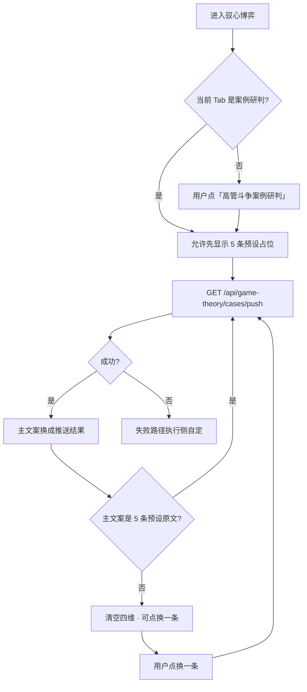

# PRD：驭心博弈刷新后案例不总是那几个 — GT-CASE-01

> **验收锚点：** `GT-CASE-01`（`test_cases_7.21_7.22_feedback.md`）  
> **模块路径：** 顶栏 → **驭心博弈** → **高管斗争案例研判**  
> **状态：** 终稿 · 已形成（deep-interview 8 轮，ambiguity 0.103）  
> **日期：** 2026-08-17  
> **原始反馈：** 7.22 博弈 —「每次重新刷新清除后的案例还是那几个」  
> **访谈规格：** `.omx/specs/deep-interview-gt-case-01-refresh-diversity.md`  
> **已确认决策：** 只做 GT-CASE-01 · 换一条要新 · 硬刷新后成功路径主文案离开 5 条预设 · 可先闪预设再后台替换 · 每次点开该 Tab 都自动再推 · 草稿默认静默覆盖 · 列表不重做 · 不扩 FALLBACK · 不改 CASE-02 / Dify YML / 任务中心

---

## 1. Executive Summary

### Problem Statement

用户在「高管斗争案例研判」里点「换一条」或 Ctrl+Shift+R / 清缓存后再进，主案例仍落在前端写死的 5 条预设（如「被稀释权力的常务副局长」），新鲜度与多样性不足。E2E `GT-CASE-01` 曾记「换一条后文本未变」；冻结表把「exclude + 本地轮换」当成已修，但硬刷新会丢掉内存 `extraCases`，成功路径仍会停在那 5 条。

### Proposed Solution

复用现有 `GET /api/game-theory/cases/push`：每次「高管斗争案例研判」Tab 变为可见时自动推送一次，允许先闪预设再替换主文案；「换一条」保持现有去重。成功路径下右侧主文案不得等于那 5 条预设原文。不重做左侧列表、不从库水合历史、不扩大 FALLBACK。

### Success Criteria

| # | KPI | 度量方式 | 目标值 |
|---|-----|----------|--------|
| 1 | 进 Tab 离开预设 | 推送成功后 `caseText` 与 5 条 `PRESET_CASES.description` 比对 | **0** 条命中 |
| 2 | 换一条有差异 | 连续成功「换一条」5 次 vs 进入时标题/正文集合 | **不完全相同** |
| 3 | 硬刷新仍离开预设 | Ctrl+Shift+R → 再进该 Tab → 推送成功 | 主文案 **不是** 那 5 条原文 |
| 4 | 切 Tab 再推 | 填一点四维 → 驭人术 → 再回案例 Tab（成功） | 主文案已替换；四维已清空 |
| 5 | 验收用例 | `GT-CASE-01` | **通过**（失败路径不否决） |

---

## 2. User Experience & Functionality

### User Personas

| 角色 | 描述 | 核心诉求 |
|------|------|----------|
| **主用户·训练者** | 用高管斗争案例做研判训练 | 每次进来、每次换一条，都能练到不同局，而不是那几个固定题 |
| **次用户·中途切走者** | 写到一半去别的博弈 Tab | 默认可被新案例覆盖；不弹确认（已授权） |

### User Stories

#### Story 1 — 换一条有新鲜度

As a 训练者, I want 连续点「换一条」后主案例与刚进来那批不一样, so that 我不是在同一组预设里空转。

**Acceptance Criteria：**

- 菜单：驭心博弈 → 高管斗争案例研判 → 「换一条」。
- 记录进入时可见标题（至少 3 个）与当前主文案。
- 连续成功点击 5 次后，主文案与初始集合不完全相同。
- 按钮在请求中显示「推送中...」，禁止连点造成并行。
- 成功后清空四维（现行为保留）。

#### Story 2 — 刷新清除后主文案不是那 5 条

As a 训练者, I want 硬刷新后再进该 Tab，成功推送后的主案例不是原来那 5 条预设原文, so that 「清除」不会把我打回固定题库。

**Acceptance Criteria：**

- Ctrl+Shift+R 后进入同一 Tab。
- 允许首屏短暂显示预设（「闪一下」）。
- 推送成功后，主文案不是下列任一原文：被稀释权力的常务副局长、派系夹缝中的合规审查、甩锅大区VP的会场狙击、核心资产重组被夺功、直属总监的压制与边缘化。
- 左侧列表形态本轮不验收（可仍显示 5 条预设 + 本次推入的 extra）。

#### Story 3 — 每次点开该 Tab 都换新

As a 训练者, I want 每次点开「高管斗争案例研判」都自动再推, so that 切走再回来也不会停在旧预设。

**Acceptance Criteria：**

- 触发：该 Tab 从不可见变为可见（含首次进入、硬刷新后首次点开、从其他博弈 Tab 切回）。
- 默认静默替换主文案并清空四维，不弹确认。
- 已在推送中则不重复发请求。

### User Flow



### 已锁定交互（ASCII）

```
┌─ 驭心博弈 ──────────────────────────────────────────┐
│ [高管斗争案例研判] 驭人术 沙盘 会话 历史 升维          │
│ ┌─ 左 30% ─────────┐  ┌─ 右 70% 主文案 ─────────────┐ │
│ │ 体制内/外企/以下克上│  │  可先闪预设，推送成功后必须  │ │
│ │ 换一条 / 推送中... │  │  不是那 5 条预设原文         │ │
│ │ 预设卡片（不重做）  │  │  四维拆解（自动推成功则清空）│ │
│ └──────────────────┘  └────────────────────────────┘ │
└─────────────────────────────────────────────────────┘
```

**示例：** 硬刷新后右栏可能先出现「前任局长调离后…」（常务副局长预设）。1–数秒后换成 push 返回的 `background + 未知信息 + 决策点`。若仍是那 5 条之一，视为成功路径未达标。

### Non-Goals

- 不改 GT-CASE-02 详实度 / 研判四节。
- 不从 `game_theory_cases` 水合左侧列表、不重做卡片。
- 不改 Dify 工作流 YML。
- 不把换一条/进 Tab 推送改成任务中心异步。
- 不扩大 `FALLBACK_CASES`。
- 不改其他博弈 Tab 的生成逻辑。

---

## 3. AI System Requirements

### Tool Requirements

- **已有：** `GET /api/game-theory/cases/push`（`vocab-server/server.js`）→ `gameTheoryCasePushService.getCasePush`。
- **已有：** Dify workflow（`apiKey` 存在时生成）；库表 `game_theory_cases`；`FALLBACK_CASES`（2 条，不扩）。
- **已有：** 前端 `pushGameTheoryCase` / `refreshPushedCase`。
- **本轮不新增** Dify 应用、不改 YML、不新队列。

### Evaluation Strategy

| 检查 | 方法 | 通过标准 |
|------|------|----------|
| 成功路径离开预设 | 单测或组件级：mock push 返回非预设 | `caseText` 不在 5 条 description 集合 |
| 换一条 exclude | 现有 `gameTheoryCasePush.test.js` 风格 | 排除 id 后不得原样返回同一 fallback id（成功时） |
| 不并行 | UI：`casePushLoading` 时按钮 disabled | 无第二发未完成请求 |
| 失败路径 | 不作为 GT-CASE-01 否决 | 有提示或现有本地轮换即可 |

Prompt / 质量门槛沿用现服务（含 CASE-02 已落地的字数启发式）；本 PRD **不**把 400 字作为本项新验收。

---

## 4. Technical Specifications

### Architecture Overview

```
Tab「高管斗争案例研判」变为可见
        │
        ▼
  若 casePushLoading 则跳过
        │
        ▼
  refreshPushedCase() 同类逻辑
        │
        ├─ GET /api/game-theory/cases/push?env=&excludeIds=
        │         │
        │         ├─ Dify 生成 → INSERT OR IGNORE game_theory_cases
        │         └─ 失败/撞库 → DB RANDOM / FALLBACK（不扩池）
        │
        ├─ 成功：写入 caseText（须 ≠ 5 预设 description）
        └─ 失败：OMX 自定（可 applyLocalRotate / alert）
```

### Integration Points

| 点 | 行为 |
|----|------|
| `GameTheoryModule` `activeTab` / `handleTabChange` | `cases` 变为可见时触发一次自动推送 |
| `refreshPushedCase` | 换一条与自动推送共用；保留 exclude 当前条 + 本环境 extraCases |
| `difyAPI.pushGameTheoryCase` | 契约不变 |
| `GET /api/game-theory/cases/push` | 契约不变 |
| `PRESET_CASES` | 保留作占位/失败轮换素材，禁止作为成功停留态 |

### Security & Privacy

- 继续走本站 `/api/`，不把 Dify key 暴露到浏览器。
- `userId` 沿用 `getAppUserId()` / 服务端 `normalizeMemoryUserId`。
- 不新增个人数据字段。

### OMX 默认可自定（不必再问）

- loading 文案与「闪一下」时长。
- 成功后若仍命中预设 description：自动再请求次数（建议 1 次）。
- 环境切换是否立即再推（建议是）。
- 失败是 alert、黄条，还是本地轮换。
- 自动推送结果是否写入 `extraCases`（不得变成列表重设计）。

---

## 5. Risks & Roadmap

### Phased Rollout

| 阶段 | 内容 |
|------|------|
| **MVP（本 PRD）** | 进 Tab 自动推 + 换一条去重；成功路径离开 5 预设；GT-CASE-01 通过 |
| **v1.1（非本轮）** | 列表从 `game_theory_cases` 水合；跨会话去重窗口 |
| **v2.0（非本轮）** | 扩大 FALLBACK / 场景覆盖；与 GT-CASE-02 体验打磨合并 |

### Technical Risks

| 风险 | 影响 | 缓解 |
|------|------|------|
| 每次点开 Tab 都打 Dify，慢或失败 | 体感仍「那几个」 | 先闪预设；失败不否决；成功路径再判一次是否预设 |
| 静默覆盖四维草稿 | 用户丢失未提交研判 | 已授权默认静默；与现「换一条」一致 |
| 冻结表「已修待部署」误导 | 只上轮换不够 | 本 PRD 覆盖硬刷新主文案 |
| FALLBACK 仅 2 条且偏 corp | 失败时多样性仍差 | 本轮明确不扩池 |

### 功能测试案例（本轮一次一项，落地后按此验）

**GT-CASE-01a 进 Tab 离开预设**

- **菜单路径：** 顶栏 → 驭心博弈 → 高管斗争案例研判
- **测试数据：** 等待「推送中」结束（成功）
- **预期结果：** 右侧主文案不是 5 条预设原文
- **对应需求：** 7.22「刷新清除后还是那几个」成功路径

**GT-CASE-01b 换一条 5 次**

- **菜单路径：** 同上 → 连续点「换一条」5 次
- **测试数据：** 记录进入时标题集合
- **预期结果：** 与初始集合不完全相同
- **对应需求：** GT-CASE-01 原用例第 1 点

**GT-CASE-01c 硬刷新**

- **菜单路径：** Ctrl+Shift+R → 再进该 Tab → 等待成功推送
- **测试数据：** 对照 5 条预设原文
- **预期结果：** 主文案仍不是那 5 条
- **对应需求：** GT-CASE-01 原用例第 2 点

**GT-CASE-01d 切 Tab 静默覆盖**

- **菜单路径：** 案例 Tab 填四维一字 → 驭人术 → 再点案例研判
- **测试数据：** 成功推送
- **预期结果：** 主文案已变；四维已空；无确认框
- **对应需求：** Round 6–7 决策
