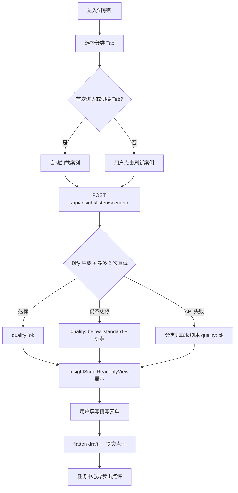

# PRD：洞察(听) 结构化长剧本 — LS-CASE-02

> **验收锚点：** `LS-CASE-02`（`test_cases_7.21_7.22_feedback.md`）  
> **模块路径：** 顶栏 → 洞察(听) → 案例分类 Tab → 刷新案例  
> **状态：** 终稿 · 已确认  
> **日期：** 2026-08-17  
> **原始反馈：** 7.21 洞察-3 —「案例较简单、场景单一、博弈不够激烈、前因后果不完整，整段对话应当 8–10 分钟」  
> **关联规格：** `docs/superpowers/specs/2026-08-16-ls-case-02-insight-script-design.md`  
> **已确认决策：** 质量门禁 A · 自动重试 A · 三套兜底 A · 范围仅刷新案例 A

---

## 1. Executive Summary

### Problem Statement

洞察(听)「刷新案例」当前产出以 **30 秒–2 分钟** 的短片段为主：单句寒暄、场景单一、缺少铺垫—试探—高潮—收束的完整因果链，博弈强度停留在「读潜台词」而非「读长局」。用户无法完成 7.21 所要求的 **8–10 分钟高强度侧写训练**；E2E 验收 `LS-CASE-02` 为「部分通过」。

### Proposed Solution

在已落地的 `ScriptWorkshopDraft` 结构化展示链路上，升级 **生成质量管线**：引入驭心剧本工坊同款 `scriptEvaluator` 作 **双层门禁**（时长 + 博弈分）；Dify 生成未达标时 **服务端自动重试 1–2 次**；为体制内 / 外企 / 通用社交 **各备一套** 经校验的 8–10 分钟标杆兜底剧本。听模块保持 **只读展示 + 侧写提交**，不引入多人会话。

### Success Criteria

| # | KPI | 度量方式 | 目标值 |
|---|-----|----------|--------|
| 1 | 案例时长 | `totalWords / 250` → `estimatedMinutes` | 黄金带 **8–10 min**；合格带 **[8, 12] min** |
| 2 | 博弈质量 | `scriptEvaluator(draft).score` | **≥ 85**（Dify 路径 ≥70% 达标；兜底 **100%**） |
| 3 | 结构完整 | 四幕 + ≥3 角色 + ≥2 信息差 | 每条案例 **100%** 具备 |
| 4 | 验收用例 | `LS-CASE-02` 三类各刷新 3 条 | **9/9** 可训练（非单句片段） |
| 5 | 降级可见 | `below_standard` 案例 | **≤30%** 且有标黄；侧写 **不阻断** |

---

## 2. User Experience & Functionality

### User Personas

| 角色 | 描述 | 核心诉求 |
|------|------|----------|
| **主用户·训练者** | 使用洞察(听)做博弈侧写练习 | 读 8–10 分钟长局，拆底牌、练因果链 |
| **次用户·场景切换者** | 在体制内 / 外企 / 通用社交间切换 | 案例风格与 Tab 语义一致、强度稳定 |

### User Flow



### User Stories

#### Story 1 — 长剧本训练（LS-CASE-02 核心）

**As a** 训练者, **I want** 刷新案例后看到 8–10 分钟完整、激烈的多方博弈长剧本, **so that** 我能练习读局而非解析单句寒暄。

**Acceptance Criteria：**

- [ ] AC1.1 展示 **结构化长剧本**：场景标题 + 摘要（≥80 字）、角色卡、四幕对白（可折叠）
- [ ] AC1.2 对白总字数 **2100–2600 字**；界面估时 **8–10 分钟**（合格带 8–12 分钟）
- [ ] AC1.3 四幕完整：**铺垫 → 试探 → 高潮 → 收束**；禁止仅阶段一有内容的片段式案例
- [ ] AC1.4 博弈强度：**≥3 角色**正文登场；**≥2 信息差**；阶段三字数占比 **≥30%**
- [ ] AC1.5 元信息：总字数、估时、质量状态（`ok` / `below_standard`）、可选 scriptScore

#### Story 2 — 质量门禁与自动重试

**As a** 训练者, **I want** 系统自动过滤低质量案例并在可能时重试, **so that** 我不必反复手动刷新碰运气。

**Acceptance Criteria：**

- [ ] AC2.1 `quality === 'ok'` ⟺ `estimatedMinutes ∈ [8,12]` **且** `scriptScore ≥ 85`
- [ ] AC2.2 未达标时服务端 **自动重试 1–2 次**（retry hint 含失败维度：duration / score / both）
- [ ] AC2.3 全部重试仍不达标：**照常展示** + 标黄（时长不足 / 博弈分不足分开展示）
- [ ] AC2.4 用户可手动「刷新案例」；`draft` 非空即可提交侧写

#### Story 3 — 分类兜底

**As a** 训练者, **I want** 任一类 Tab 在 API 失败时也有同风格长剧本, **so that** 训练不中断。

**Acceptance Criteria：**

- [ ] AC3.1 体制内 / 外企 / 通用社交 **各 1 套** 独立长剧本（非改标题共用）
- [ ] AC3.2 每套兜底：字数 **2100–2600**、估时 **8–10 min**、**scriptScore ≥ 85**
- [ ] AC3.3 场景语义与分类一致（见 §2.4 兜底题材表）
- [ ] AC3.4 Dify 失败或 JSON 不可解析 → 返回分类兜底，`quality: ok`

#### Story 4 — 侧写链路（兼容）

**As a** 训练者, **I want** 长剧本 flatten 后照常提交侧写, **so that** 点评引擎无需改造。

**Acceptance Criteria：**

- [ ] AC4.1 `scenario_text = flattenInsightScript(draft)`（含场景、角色、四幕）
- [ ] AC4.2 `/api/insight/listen/feedback` 请求形状不变
- [ ] AC4.3 页面 **无**「导入会话 / 开始对战 / 工坊编辑」

### 2.4 三类兜底题材（内容 brief）

| 分类 | 场景设定（示例） | 角色数 | 冲突核心 |
|------|------------------|--------|----------|
| **体制内** | 季度考核前夜处室闭门协调 | 4 | 编制倾斜、延迟指标甩锅、捧杀与站队 |
| **外企** | 跨文化战略复盘会 / 交付问责 | 4 | 推责话术、接口冻结要挟、总部与本地利益 |
| **通用社交** | 社区/neighbor 饭局或租房续签 | 3–4 | 探路、信息不对等、站队暗示、面子与里子 |

### Non-Goals

- 不覆盖「分布式素材上传」训练题（LS-MAT-01）
- 不开多人群体博弈会话、不导入驭心沙盘
- 不嵌入 `ScriptWorkshopDrawer` 编辑能力
- 不改左侧理论框架库（LS-KNOW-01）与 Word 导出
- 不因质量门禁阻断侧写或隐藏内容
- 不做 TTS 朗读长剧本（属 EN-LIS 范围）

---

## 3. AI System Requirements

### Tool Requirements

#### 已有（复用，不重复造轮子）

| 组件 | 路径 |
|------|------|
| 剧本结构 | `ScriptWorkshopTypes.ts` → `ScriptWorkshopDraft` |
| 质量引擎 | `scriptEvaluator.ts` → 100 分制（时长 30 + 因果 40 + 博弈 30） |
| 只读 UI | `InsightScriptReadonlyView.tsx` |
| flatten | `insightScript.ts` → `flattenInsightScript` |
| API | `POST /api/insight/listen/scenario` |
| Dify | `insightSpeakProxy.js` → Insight Gen |

#### 本轮补齐

1. **双层门禁函数** — 前端 + 服务端统一调用 `evaluateScriptDraft`
2. **重试循环** — `server.js` / `insightScenarioScript.js`，最多 3 次 Dify 调用
3. **分类兜底库** — `insightScenarioFallbacks.json` 按 category 分三套
4. **Dify Prompt 升级**（仓外）— 输出约束见 §3.2

### 3.2 Dify Prompt 输出契约

模型必须返回 **唯一 JSON 对象**，字段对齐 `ScriptWorkshopDraft`：

```json
{
  "sceneTitle": "【{category}】…",
  "sceneSummary": "≥80字，交代前因与 stakes",
  "characters": [
    {
      "id": "c1", "name": "…", "roleTitle": "…",
      "surfaceGoal": "…", "hiddenMotive": "…",
      "redLine": "…", "winCondition": "…"
    }
  ],
  "infoMatrix": [
    { "id": "info-1", "type": "public", "title": "…", "content": "…" },
    { "id": "info-2", "type": "exclusive", "owner": "…", "title": "…", "content": "…" }
  ],
  "phases": [
    { "phaseId": 1, "title": "阶段一：…", "content": "350–450字对白" },
    { "phaseId": 2, "title": "阶段二：…", "content": "550–700字" },
    { "phaseId": 3, "title": "阶段三：…", "content": "750–900字" },
    { "phaseId": 4, "title": "阶段四：…", "content": "250–350字" }
  ]
}
```

**硬约束：**

- `characters.length ≥ 3`
- `infoMatrix.length ≥ 2`
- 四幕 `content` 合计 **2100–2600 汉字**
- 对白格式：`**角色名**（动作/神态）：台词`
- 禁止：单段摘要冒充对白、无阶段二/三的空壳

**Retry hint 模板（第 2/3 次调用）：**

```
上次生成未达标：totalWords={n}（需≥2100），scriptScore={s}（需≥85），
失败维度={duration|score|both}。请重新生成完整四幕对白，加强阶段三博弈与信息差。
```

### Evaluation Strategy

| 层级 | 方法 | 通过标准 |
|------|------|----------|
| **单元测试** | `insightScript.test.ts`、`insightScenarioScript.test.js` | 1999 字→fail；2100 字+score 85→ok；重试 mock |
| **兜底 CI 校验** | 脚本扫描三套 fallback | 每套 words∈[2100,2600] 且 score≥85 |
| **契约测试** | API 响应 schema | 含 `evaluation.scriptScore`、`retryCount` |
| **手工验收** | LS-CASE-02 | 三类×3 刷新，见 §5 附录 |
| **生产抽检** | 日志（可选） | Dify 路径 7 日达标率 ≥70% |

**scriptEvaluator 博弈最低线（与工坊对齐）：**

| 指标 | 阈值 |
|------|------|
| 角色数 | ≥ 3，正文均登场 |
| 信息差矩阵 | ≥ 2 项 |
| 对白轮次 | ≥ 16 |
| 阶段三占比 | ≥ 30% |
| 综合分 | ≥ 85 |

---

## 4. Technical Specifications

### Architecture Overview

```
ListenModule.loadNewScenario(category)
    │
    ▼
POST /api/insight/listen/scenario { category, userId }
    │
    ├─► loop attempt = 1..3:
    │       Dify Insight Gen → tryParseDraft
    │       evaluateFull(draft) → { passedDuration, passedScript, scriptScore }
    │       if both pass → break (quality=ok)
    │       else if attempt < 3 → retry with hint
    │
    ├─► 3 次均未达标 → bestScoreDraft, quality=below_standard
    │
    └─► Dify 失败 / 无 JSON → getFallbackDraft(category), quality=ok

    ▼
{ draft, evaluation, quality, retryCount, scenario }
    ▼
InsightScriptReadonlyView → flatten → /api/insight/listen/feedback
```

### API 契约

**请求：** `POST /api/insight/listen/scenario`

```json
{ "category": "体制内 | 外企 | 通用社交", "userId": "…" }
```

**响应：**

```ts
{
  success: true,
  draft: ScriptWorkshopDraft,
  evaluation: {
    totalWords: number,
    estimatedMinutes: number,
    passedDuration: boolean,   // minutes ∈ [8, 12]
    scriptScore: number,       // evaluateScriptDraft.score
    passedScript: boolean      // score ≥ 85 && report.passed
  },
  quality: 'ok' | 'below_standard',
  retryCount: number,          // 0 | 1 | 2
  scenario: string
}
```

```ts
quality = (passedDuration && passedScript) ? 'ok' : 'below_standard'
```

### Integration Points

| 层级 | 文件 | 改动 |
|------|------|------|
| 后端核心 | `vocab-server/services/insightScenarioScript.js` | 双层门禁、重试、分分类兜底 |
| 兜底数据 | `vocab-server/services/insightScenarioFallbacks.json` | 三套长剧本 |
| 路由 | `vocab-server/server.js` | 重试循环接入 Dify |
| 前端评估 | `src/utils/insightScript.ts` | 扩展 evaluation + quality 双条件 |
| 前端 UI | `InsightScriptReadonlyView.tsx` | 标黄文案、scriptScore |
| 前端容器 | `ListenModule.tsx` | 消费扩展字段 |
| 测试 | `*.test.ts` / `*.test.js` | 边界 + 重试 mock |
| 仓外 | Dify Insight Gen | Prompt 按 §3.2 升级 |

### 现状差距（Gap Analysis）

| 能力 | 现状 | 本 PRD 目标 |
|------|------|-------------|
| 时长门禁 | ✅ 8–12 min | 维持 |
| 博弈分门禁 | ❌ 未接入 | ✅ scriptScore ≥ 85 |
| 自动重试 | ❌ 无 | ✅ 最多 2 次 retry |
| 分类兜底 | ⚠️ 单套 + 改前缀 | ✅ 三套独立题材 |
| 短片段 fallback | ⚠️ `FALLBACK_SCENARIOS` 单句 | ✅ 废弃作展示，改长剧本 |
| Dify 短文本包装 | ⚠️ `wrapPlain` 假结构化 | ✅ 短文本触发 retry，仍失败标黄 |
| 结构化 UI | ✅ 已实现 | 维持，扩展标黄 |

### Security & Privacy

- Dify 鉴权走既有环境变量；响应不含 API Key / 内部 taskId
- 长剧本正文会话态展示；侧写提交截断上限与现网一致
- 兜底剧本为静态内置，无用户 PII

---

## 5. Risks & Roadmap

### Phased Rollout

| 阶段 | 交付物 | 验收 |
|------|--------|------|
| **MVP**（本轮） | 双层门禁 + 三套分类兜底 + 服务端重试 1–2 次 + UI 标黄扩展 + Dify Prompt 升级 | LS-CASE-02 全过；兜底 100% 达标 |
| **v1.1** | 刷新异步化（任务中心进度）；`retryCount` / 达标率仪表盘 | 刷新 P95 < 45s 或可追踪 |
| **v1.2** | UI 展示博弈摘要（brokenLinks 摘要、阶段占比条） | 用户可读性提升 |
| **v2.0** | 上传素材训练题同标（另开 PRD，不在 LS-CASE-02） | — |

### Technical Risks

| 风险 | 影响 | 缓解 |
|------|------|------|
| Dify 长 JSON 超时 | 刷新慢 / 失败 | 重试 + 兜底；v1.1 异步 |
| 三次调用成本 | Token / 延迟 | 上限 3 次；超时即兜底 |
| 社交类写偏职场 | 不符 LS-CASE-01 | 兜底 brief + 关键词验收 |
| 仅字数达标博弈水 | 假达标 | 双层门禁 |
| 与工坊剧本重复 | 体验同质 | 兜底题材差异化 |

---

## 附录 A — 验收用例 LS-CASE-02

| 项 | 内容 |
|----|------|
| **菜单路径** | 洞察(听) → 刷新案例 → 任选一类 |
| **测试数据** | 体制内 / 外企 / 通用社交 **各连续刷新 3 条** |
| **预期 1** | 每条有完整前因后果（四幕 + 角色卡），非单句片段 |
| **预期 2** | 估时 **8–10 分钟**（界面字数 / 估时可见） |
| **预期 3** | 博弈强度明显高于寒暄（≥3 角色、底牌可见、阶段三最长） |
| **预期 4** | `quality=ok` 占比 ≥70%；标黄案例仍可侧写 |
| **预期 5** | 无「导入会话 / 开始对战」 |
| **对应需求** | 7.21 洞察-3 全文 |

---

## 附录 B — Before / After（已确认）

**Before（≈30 秒，片段式）：**

> 两位项目负责人在走廊相遇。A：「听老李说你们组项目拿下了？……真羡慕你们这股拼劲！」

**After（≈8–10 分钟，结构化）：**

```
【场景】体制内·季度考核前夜资源协调
【摘要】处室主任召集两组组长闭门，表面谈协作，实则争夺编制…（≥80字）

【角色】王处长 / 李组长 / 赵组长 / …（各含表层、底牌、红线）

【阶段一–四】合计 2280 字，估时 9.1 min，scriptScore: 91，quality: ok
```

---

## 附录 C — 修订记录

| 日期 | 版本 | 说明 |
|------|------|------|
| 2026-08-17 | v0.1 | 初稿；用户确认四项均选 A |
| 2026-08-17 | **v1.0 终稿** | 对齐 Strict PRD Schema；重试纳入 MVP；补 User Flow / Gap / Prompt 契约 |
