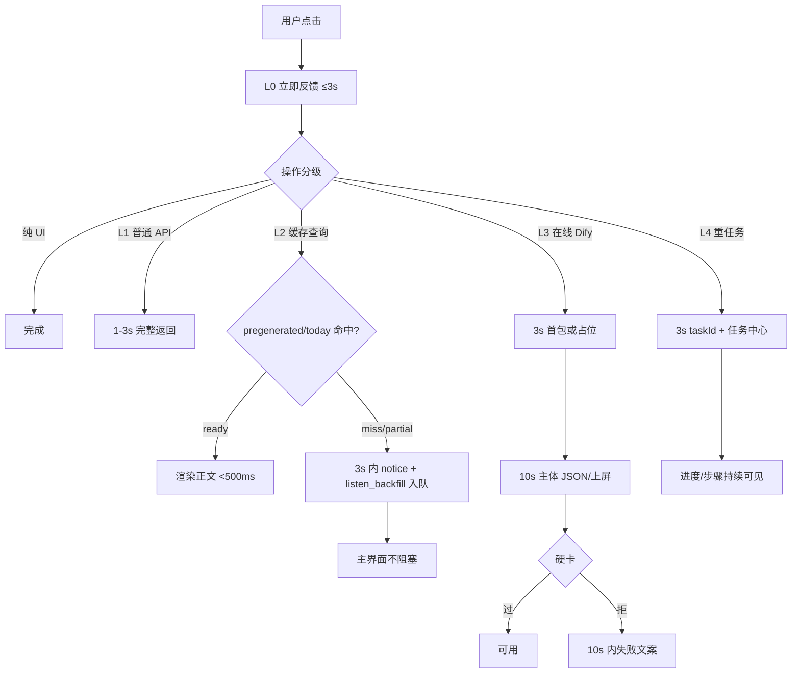

# PRD：全站交互 3 秒反馈 + 业务分层 1–3s / 10s 主体 — PERF-SLA-01

> **验收锚点：** `PERF-SLA-01`（建议写入 `test_cases_7.21_7.22_feedback.md`）  
> **模块路径：** **全站一切点击**（顶栏七模块 + 英语子 Tab + 任务中心 + 资料抽屉 + 语音/画像/登录后首屏）  
> **状态：** 草稿 · 待用户审阅确认  
> **日期：** 2026-08-19  
> **原始诉求：** 交互层 &lt; 3 秒禁止静默/白屏；普通 API 1–3 秒返回；Dify 重任务 3 秒首包、10 秒主体；不改原有业务与契约  
> **已确认决策：** 分层渐进指标（1A）· 覆盖全站一切点击 · 听材料复用 02:00 预生成 + `listen_backfill`（命中 &lt;500ms；未命中 3 秒通知并后台，主界面不阻塞）· 不改业务需求/交互协议/数据契约 · 优先复用 SSE 收口、任务中心、去重、骨架屏  
> **Dify 文档：** [Consume Streaming Responses](https://docs.dify.ai/en/api-reference/guides/streaming)、[Send Chat Message](https://docs.dify.ai/en/api-reference/chat-messages/send-chat-message)

---

## 1. Executive Summary

### Problem Statement

用户触发操作后，部分路径会卡在 Dify `blocking` 等待或服务端把 SSE **收完再一次性 JSON 返回**，出现超过 3 秒的静默、白屏或假死；未命中预生成时，听力等重任务还会把主界面堵住。现有任务中心、`listen_backfill`、GET 去重已能解决一类问题，但未上升为全站双层 SLA。

### Proposed Solution

把全站点击分成四层交付，**不改业务功能与对外契约**：普通查询/提交 1–3 秒完整返回；一切点击 3 秒内必须有可见反馈；Dify 在线交互 3 秒首包流式（或等价首波视觉），10 秒交付主体文案；可缓存的听材料继续走 02:00 预生成，命中 &lt;500ms，未命中 3 秒内通知并提交 `listen_backfill`，主界面不阻塞。其它重任务对齐同一「即时回执 + 任务中心」范式，不新造队列。

### Success Criteria

| # | KPI | 度量方式 | 目标值 |
|---|-----|----------|--------|
| 1 | 交互层零静默 | 从 pointerup/click 到首个可见反馈（按钮态 / toast / 骨架 / 任务行 / 步骤文案 / 首字） | **100%** 操作 **≤ 3000ms** |
| 2 | 普通 API | 无 LLM 的本站 GET/POST 完整 HTTP 响应（p95，本机或同源 `/api`） | **1000–3000ms** 内返回，**p95 ≤ 3000ms** |
| 3 | 听预生成命中 | `GET /api/listen/pregenerated` 且 `status=ready` 后主文区出现正文+可播地址 | **p95 &lt; 500ms**（含渲染） |
| 4 | Dify 在线主体 | 在线交互类（见 §2 分级 L3）：首包/首波视觉 ≤3s；主体文案在屏或同契约 JSON 齐备 | **≤ 10000ms** |
| 5 | 听未命中不阻塞 | `missing/partial` → notice + `taskId` 入任务中心，Listen 主工作台仍可切走/改筛选 | 提交路径 **≤ 3000ms**；主界面 **无同步死等** |

---

## 2. User Experience & Functionality

### User Personas

| 角色 | 描述 | 核心诉求 |
|------|------|----------|
| **主用户·每日训练者** | 早间进站，切听/说/读/写/博弈 | 点什么都立刻有反应；有缓存就秒开；没有也不卡死 |
| **次用户·临场生成者** | 点「换一条 / 生成场景 / 教练评估 / 沙盘」 | 3 秒内看到在生成，10 秒内能读到主体，而不是空转圈 |
| **对照用户·后台等待者** | 上传视频、高保真 TTS、导出 Word | 3 秒进任务中心后可离开；不要求 10 秒出完整媒体文件 |

### 分层定义（全站强制）

从用户手势 `T0` 起算（`click` / `pointerup` / Enter 提交）。

| 层级 | 名称 | 覆盖 | T0+3s 必须 | T0+10s 必须 | 禁止 |
|------|------|------|------------|-------------|------|
| **L0** | 交互反馈层 | **全站一切点击**，含无网络的纯 UI | 明确反馈：按下态、骨架、`ModuleSkeleton`、notice、任务行、步骤文案 | 不要求业务完成 | 静默、白屏、主线程假死无感知 |
| **L1** | 普通 API | 词表/统计/健康检查/任务轮询/主题列表/login-ping/预生成 **查询** / 今日包 **读缓存** / 字典命中 | **完整返回**（1–3 秒） | 同左（已完成） | 为等 LLM 把普通查询拖过 3 秒 |
| **L2** | 缓存即点即出 | 当日听 `ready`（5/15/25 分钟组合）；02:00 已写好的唤醒包 | 正文可见 | 同左 | 命中后仍转全屏 loading |
| **L3** | Dify 在线交互 | 主界面仍同步等待结果的模型调用：案例推送、口语沙盘回复、写作评测、说场景若仍走同步、短听/点评等 | 首波视觉 **或** 流式首包（首字/首个 `message`/`text_chunk`） | **主体内容**在屏或原 JSON 字段齐备 | 改 inputs 名、改业务硬卡、浏览器直连 Dify Key |
| **L4** | 重任务后台 | 听未命中 backfill、长剧本、TTS、资料/驭人术上传提炼、`vault_refine`、导出、视频转写 | notice + `taskId`（现有任务中心契约）；主界面不阻塞 | **文本类**任务：`task.result` 主体文案应齐备；**媒体/文件类**不要求 10 秒出片，但进度必须持续可见 | 主界面死等；新建第二套队列 |

**「主体内容」操作化（不改字段名，只规定何时算齐）：**

| 操作 | 10 秒主体 = 已有契约中的 | 明确不算 10 秒主体 |
|------|--------------------------|-------------------|
| 听 `ready` | `article.body` + `audio.audioUrl` | — |
| 听 long / backfill 文本 | `task.result.content`（可读剧本） | 高保真整段 TTS 文件 |
| 博弈换一条 / 进 Tab 推送 | 右侧主文案 = `background` + 未知信息 + 决策点 | 四维拆解后置生成 |
| 说·场景 | 工作台场景主文案 | 录音文件 |
| 说·教练评估 | 评估主段（现有 JSON） | — |
| 口语沙盘 | 助手一条完整 `reply` 正文 | — |
| 写·评测 | 现有 review 返回体 | — |
| 唤醒今日包 | `/api/daily-pack/today` 缓存包 | 当场重跑 Dify |
| 加深 / 上传提炼 | 任务完成时的导图/笔记（L4 文本） | 允许 &gt;10s，但 3s 内必须已入队 |
| 视频转写 / 导出 docx / TTS | L4 进度 | 完整媒体/文件 |

### User Stories

#### Story 1 — 任何点击 3 秒内有感知

As a 训练者, I want 点顶栏、按钮、上传、换一条、打开抽屉后立刻看到系统在干活, so that 我不会以为卡死。

**Acceptance Criteria：**

- 覆盖：英语引擎 / 洞察(听) / 破局(说) / 穿透(读) / 文治(写) / 驭心博弈 / 高阶审美 / 任务中心 / 资料抽屉 / 语音下拉。
- `T0+3000ms` 前至少一种：按钮 loading、骨架、`showNotice`/`toast`、任务中心新行、步骤文案、流式首字。
- 顶栏切模块继续用已有 `startTransition` + `ModuleSkeleton`；首次 lazy 加载不得白屏超过 3 秒。
- 已在 loading 的按钮须禁用连点（沿用现有 `disabled` / inflight 去重，不新造协议）。

#### Story 2 — 普通查询 1–3 秒结束

As a 训练者, I want 打开词表、今日包、预生成查询、任务列表这类非生成接口很快结束, so that 首页和切 Tab 不被单个慢请求拖死。

**Acceptance Criteria：**

- L1 接口 p95 ≤ 3s；超时须有明确错误/降级，不得无限转圈。
- 复用已有：`difyAPI` GET `inflightGetRequests`、`vocabAPI.queryDictionaryWithCache`、`getTodayDailyPack` inflight 合并、字典并发限制。
- `/api/daily-pack/today` **读缓存**视为 L1（目标 ≤3s）。当前前端 5s abort 视为相对本 SLA 的缺口，优化时只收紧超时与读路径，不改包结构。
- 禁止在 L1 路径上同步打 Dify。

#### Story 3 — 听：命中秒开，未命中后台补

As a 训练者, I want 当天常用听力组合打开就能练；没有缓存时告诉我去任务中心等, so that 主界面不堵。

**Acceptance Criteria：**

- 菜单：顶栏 → 洞察(听) → 选体裁/CEFR/时长 ∈ {5,15,25}。
- `status=ready`：正文+音频 p95 &lt; 500ms，无整页阻塞 spinner。
- `missing/partial`：3 秒内 notice「已提交后台生成，请稍后在任务中心查看。」（或现有等价文案）+ `POST /api/listen/pregenerated/backfill` 返回 `taskId`；任务类型 `listen_backfill`。
- 主工作台不 `await` 生成结束；可切换筛选或离开模块。
- 时长 ∉ {5,15,25}：保持现有实时生成，不强制 backfill CTA（`DESIGN.md` 已锁）；仍须满足 L0；若走 Dify 则按 L3/L4 现有入口归类。
- 02:00 Asia/Shanghai：在每日包 job **之后**跑 `runDailyListenCronJob`（已有，不改时刻与选人规则）。

#### Story 4 — Dify 在线：3 秒首包，10 秒主体

As a 训练者, I want 换案例、沙盘对话、评测这类当场要看的结果 10 秒内能读到主体, so that 不是盯着空白等完整工作流结束。

**Acceptance Criteria：**

- L3 操作：`T0+3s` 前出现流式首字 **或** 已批准的占位（如案例「先闪预设」）+ 明确「推送中/生成中」。
- `T0+10s` 主体字段齐备（见上表）。质量硬卡（CASE-02 / 听加深 / 说场景等）**仍在收齐后执行，不删、不改阈值**；硬卡拒收算业务失败，须在 10 秒内给出失败文案（可重试），不算静默。
- 对外仍是现有 JSON/GET/POST；禁止把浏览器改成直连 Dify；禁止改 `inputs` 声明变量。
- 首包流式优先复用服务端已有 `response_mode: 'streaming'` + `mergeStreamAnswer`；允许把增量写入**已有** `task.logs` / `task.progress` / `task.result.content` 渐进填充，不新增字段名则不算契约变更。若必须加可选字段，须另开确认（默认本 PRD 不加）。

#### Story 5 — 重任务：任务中心范式，主界面不阻塞

As a 训练者, I want 长剧本、TTS、上传、加深、导出、转写点完就能去干别的, so that 重活不绑架当前页。

**Acceptance Criteria：**

- 复用 `taskQueue.createTask` + `GlobalTaskCenter` + `useTask().addTask`。
- 已有类型继续用：`listen_backfill` / `material` / `tts` / `video` / `vault_refine` / `vocab_export` / `tactics_export` / `vault_export` / `tactics_ingest` / `insight_listen` / `speak` / `game_theory` / `image-gen`。
- 3 秒内 `res.json({ taskId })`（或现有等价立即回执）+ 前端任务行可见。
- 文本类 L4：以 10 秒内 `result.content`（或该类型现有 result 主字段）为目标；未达标记 SLA 缺口，但 UI 只要进度连续更新即不构成静默违规。
- 媒体/文件类 L4：10 秒 SLA **不适用完整文件**；必须有分步 `logs`（上传/转写/合成）。

### User Flow



### 已锁定交互（ASCII）

```
示例 A · 听命中（L2）
T0  洞察(听) 选 meeting / B1 / 15m
T0+0.5s  正文+播放器已在，无全屏转圈

示例 B · 听未命中（L4 = Listen Backfill）
T0  同一筛选但 status=missing
T0+1s  黄条/notice：已提交后台生成，请在任务中心查看
T0+2s  顶栏任务中心出现 listen_backfill
同时   用户可切到「破局(说)」——主界面未死等

示例 C · 博弈换一条（L3）
T0  驭心博弈 → 高管斗争案例研判 → 换一条
T0+0.3s 按钮「推送中...」；允许右栏先闪预设
T0+3s  不得仍无任何变化
T0+10s 主文案为 push 返回的三块主体（成功）或明确失败

示例 D · 普通 API（L1）
T0  打开生词本列表 / 任务轮询 / 预生成 GET
T0+3s  JSON 已返回或明确超时文案
```

### Non-Goals

- 不改任何已上线业务规则、出题硬卡、确认闸门、注入上限、Dify YML / 已声明 `inputs`。
- 不改对外交互协议与数据契约（请求路径、必填字段、成功/失败 JSON 形状）；不加新 Dify 应用、不把 API Key 放到浏览器。
- 不新建任务队列或第二套 Task UI；不把 GT-CASE-01 的换一条改成「只能去任务中心看」（案例仍为 L3 在线交互）。
- 不扩大听预生成范围：仍仅 5/15/25 分钟、不预生成历史主题/全量系统主题（`DESIGN.md`）。
- 不改 02:00 cron 选人、时区、先 pack 后 listen 的顺序。
- 不做视觉改版、不引入新动画库、不优化与 SLA 无关的模块内部算法。
- 不把视频转写/整段 TTS/docx 打包纳入「10 秒必须出完整文件」。

---

## 3. AI System Requirements

### Tool Requirements

| 能力 | 复用（禁止平行造轮） | 本 PRD 用法 |
|------|----------------------|-------------|
| Dify SSE | 官方 `response_mode: streaming`；仓内 `collectDifyStreamingAnswer` + `difyStreamMerge.js` | L3/L4 **对内**流式；对外维持现有 HTTP JSON / task 契约 |
| 预生成 | `GET /api/listen/pregenerated`；cron `runDailyListenCronJob` | L2 命中 &lt;500ms |
| Backfill | `POST /api/listen/pregenerated/backfill` → `listen_backfill` | L2 未命中；主界面不阻塞 |
| 任务中心 | `taskQueue` + `GlobalTaskCenter` + `addTask` | 一切 L4 |
| 去重 | GET inflight、字典 cache、today inflight、案例 exclude | 减并发，不充当生成加速器 |
| 骨架 | `ModuleSkeleton`、Listen compact banner、案例预设闪现 | L0/L3 首波视觉 |

官方约束（必须遵守，不可发明另一种事件流）：

- 用户可见长任务用 **streaming**；`blocking` 有网关打断风险（Cloudflare 约 100s；本站还曾为避 524 停过短文 blocking）。
- Chatflow/Workflow 约每 10 秒 `ping`；读超时须大于 ping 间隔；首个有意义帧是 `data:` 事件（如 `workflow_started` / `message`），不是裸 `ping`。
- 按 `\n\n` 重组 SSE，不假设每个 TCP chunk 完整。
- 终态：`message_end` / `workflow_finished`；中途失败看 `error` 或 `status: failed`。

### Evaluation Strategy

| 检查 | 方法 | 通过标准 |
|------|------|----------|
| L0 3s | 手工秒表或 Performance 标记；关键路径可加测试时间戳 | 无操作超过 3s 无反馈 |
| L1 p95 | 对 health / tasks / pregenerated GET / today（有缓存）打点 | p95 ≤ 3000ms |
| L2 500ms | 预置 `ready` 组合后切筛选 | 正文+audioUrl &lt;500ms |
| L3 10s | 案例推送、沙盘一句、写作评测：从 click 到主体 DOM/JSON | ≤10s 或 10s 内可见失败 |
| L4 不阻塞 | 听 missing 点后台生成后 3s 内切走顶栏 | 无整页死等；任务行存在 |
| 契约不变 | 现有契约单测继续绿（push / backfill / today / export-background） | 无字段改名、无路径替换 |
| 硬卡仍在 | 听加深 / CASE-02 / 说场景夹具 | 合格/不合格对不因 SLA 放行 |

**基线未知项：** 全站 p95 现状仓库无统一埋点。落地第一步允许只读探针（时间戳日志），**不改响应体**。

---

## 4. Technical Specifications

### Architecture Overview

```
点击 T0
  ├─ 同步 UI：disabled / skeleton / notice          ← L0 ≤3s
  ├─ L1 fetch 本站只读/轻写 ─────────────────────── 1–3s JSON
  ├─ L2 GET /api/listen/pregenerated
  │     ├ ready  → 渲染
  │     └ miss   → POST backfill → taskId → TaskCenter（UI 不等待）
  ├─ L3 本站代理 Dify streaming（已有）
  │     ├ 3s：占位或首 chunk 上屏
  │     └ 10s：完整主体 + 原样 JSON 返回（硬卡仍后置）
  └─ L4 createTask → 立即 JSON {taskId}
        └ 后台 collect/merge SSE → 更新 progress/logs/result
```

**根因（只读结论，供本 PRD 约束实现方向，本文件不授权改代码）：**

1. 多处前端 `response_mode: 'blocking'` + 10s abort，用户侧像「什么都没发生直到超时」。
2. `collectDifyStreamingAnswer` 把 SSE 吃完才给调用方，流式对用户不可见。
3. 听预生成与 `listen_backfill` 已具备正确 UX，但未推广为全站 L4 标准。
4. PERF-01 明确「不优化 LLM 耗时」——本 PRD 覆盖的是 **交付形态与缓存命中**，不是换模型。

### Integration Points

| 点 | 契约（保持） | SLA 归类 |
|----|--------------|----------|
| 顶栏 `TABS` 七模块 | `setActiveModule` | L0 |
| `GET /api/listen/pregenerated` | 现有 query + `PregeneratedResponse` | L1 查询 / L2 命中渲染 |
| `POST /api/listen/pregenerated/backfill` | `{ success, taskId }` | L4，3s 回执 |
| `POST /api/listen/generate-material-long` | 立即 `taskId` | L4 |
| `GET /api/game-theory/cases/push` | 现有 query | L3（允许先闪预设） |
| `/api/english/oral-sandbox` | 现有 body | L3 |
| `/api/dify/write-review` 等评测 | 现有 | L3 |
| `/api/daily-pack/today` | 现有 query | L1 读缓存 |
| 资料/驭人术上传、导出 background | 现有 `taskId` | L4 |
| `vault_refine` | 现有任务类型 | L4 |
| 字典 `/api/dify/dict-query` | 现有；走 cache/限流 | L1（缓存命中）/ 未命中仍 L0+超时可见 |

### Security & Privacy

- 继续只走本站 `/api/`，Dify Key 留服务端。
- 预生成与任务按现有 `userId` 隔离，不跨用户读缓存。
- 不把 SSE 原始密钥或模型供应商错误细节新暴露到浏览器（可继续用已有 `formatDifyModelError` 友好句）。

### OMX 默认可自定（不必再问）

- L0 反馈组件选型（toast vs notice vs 按钮 spinner），只要 3 秒内可见。
- L3 首包是真流式上屏还是「占位 + 3 秒内必须有进度」，在契约不变前提下二选一或组合。
- 只读计时探针的日志格式。
- 文本类 L4 10 秒未写出主体时：继续跑 + 任务中心警告，不自动取消业务任务。
- 将哪些**当前误用 blocking 且已有 task 入口**的按钮改为只走任务中心（行为需与现文案一致：「已提交后台」）。

须再问用户的（本 PRD 默认 **不做**）：

- 给 JSON 响应新增流式字段名。
- 把案例推送改成任务中心异步（会与 GT-CASE-01 冲突）。
- 把 5/15/25 以外的时长纳入 cron 缓存。

---

## 5. Risks & Roadmap

### Phased Rollout

| 阶段 | 内容 |
|------|------|
| **MVP（本 PRD）** | L0 全站零静默；L1 普通 API ≤3s；听 L2/L4 按已有预生成+backfill 验收；L3 清单内在线 Dify 3s/10s；L4 重任务一律不堵主界面 |
| **v1.1（非本轮功能）** | 统一只读 SLA 埋点看板；blocking→对内 streaming 的逐接口改造 |
| **v2.0（非本轮）** | 跨模块预热更多缓存（须单独 PRD，避免破坏「不扩大预生成范围」） |

### Technical Risks

| 风险 | 影响 | 缓解 |
|------|------|------|
| 长剧本/硬卡重试使 10s 达不到 | L3/L4 文本 SLA 失败 | 10s 内必须有主体 **或** 明确拒收/重试文案；不删硬卡 |
| 把 SSE 接到浏览器会改协议 | 违约 | 默认只对内 streaming，对外 JSON/task 不变 |
| `today` 5s 超时、词表 500ms 竞速导致空 history | L1/唤醒体验 | 当 L1 缺口修：只读加速与超时，不改包 schema |
| Dify 下游 38000 连接超时 | 任何生成 | 已有错误文案；L0 仍要在 3s 内显示「失败/重试」 |
| 全站范围过大 | 一次改爆 | 实现时按模块验收（一次一项）；本 PRD 先锁标准与分级表 |
| 与 PERF-01「不优化 LLM」表面冲突 | 范围争论 | 本 PRD 优化 **反馈与缓存/任务形态**，不换模型、不砍功能 |

### 功能测试案例（落地后一次一项；本节仅规格）

**PERF-SLA-01a 顶栏切模块 3 秒反馈（先做这一项时用）**

- **菜单路径：** 英语引擎 → 洞察(听) → 驭心博弈 → 再回英语引擎  
- **测试数据：** 无；记录 T0 与首屏骨架/内容出现时刻  
- **预期结果：** 每次切换 ≤3s 有模块骨架或内容，无白屏静默  
- **对应需求：** L0 全站点击  

**PERF-SLA-01b 听预生成命中 &lt;500ms**

- **菜单路径：** 洞察(听) → 选已 `ready` 的 5/15/25 组合  
- **测试数据：** 02:00 或手动 backfill 完成后的当日组合  
- **预期结果：** 正文+可播音频 p95 &lt;500ms  
- **对应需求：** L2  

**PERF-SLA-01c 听未命中 backfill 不阻塞**

- **菜单路径：** 洞察(听) → 选 `missing` 的可缓存组合 → 后台生成 → 立即点「破局(说)」  
- **测试数据：** 该组合无当日缓存  
- **预期结果：** ≤3s 出现 notice + 任务 `listen_backfill`；说模块可进入；Listen 页未死等  
- **对应需求：** 用户确认的 Listen Backfill 范式  

**PERF-SLA-01d 普通 API ≤3s**

- **菜单路径：** 打开任务中心列表 / 听页预生成 GET / 有缓存时今日唤醒  
- **测试数据：** 服务健康、当日已有 pack  
- **预期结果：** p95 ≤3s 返回；失败有文案  
- **对应需求：** L1  

**PERF-SLA-01e 博弈换一条 3s/10s**

- **菜单路径：** 驭心博弈 → 高管斗争案例研判 → 换一条  
- **测试数据：** 成功路径（Dify 或库）  
- **预期结果：** ≤3s「推送中」或占位；≤10s 主体三块上屏或失败文案；成功路径仍离开 5 条预设（GT-CASE-01 不回退）  
- **对应需求：** L3 + 不改原功能  

**PERF-SLA-01f 资料上传 L4**

- **菜单路径：** 资料抽屉 → 上传文件/视频 → 立即切顶栏  
- **测试数据：** 小 PDF 或短视频  
- **预期结果：** ≤3s 任务行出现；主界面可离开；完成态仍出导图/草稿（业务不变）  
- **对应需求：** L4  

---

## 审阅检查（作者自检）

- 无 TBD 占位；「主体内容」已按操作落到现有字段。  
- L2 未命中「主界面不阻塞」与 L3「10 秒主体」不冲突：听 miss 走 L4，案例仍走 L3。  
- 范围是全站标准 + 分级表，不是一次改完所有文件的实现许可。  
- 未授权改代码；确认本 PRD 后另开实现计划，且按测试案例一次一项。
