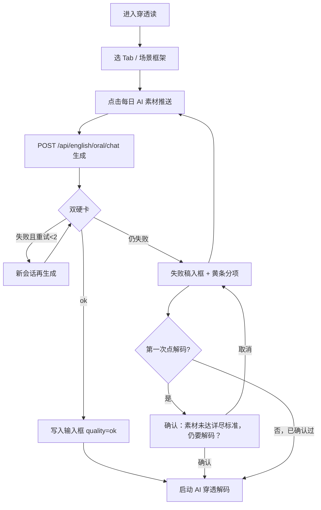

# PRD：穿透(读) AI 推送素材够详尽 — RD-LEN-01

> **验收锚点：** `RD-LEN-01`（`test_cases_7.21_7.22_feedback.md`）  
> **模块路径：** 顶栏 → **穿透(读)** → 每日 AI 素材推送  
> **状态：** 终稿 · 已形成  
> **日期：** 2026-08-17  
> **原始反馈：** 7.21 读 —「AI 推送的素材都较简短，不如我自己粘贴的网站或者是文档详尽」  
> **关联规格：** `docs/superpowers/specs/2026-08-16-feedback-7.21-7.22-frozen-specs.md`（本 PRD **覆盖**其中「不以结构字段齐全作硬卡」）  
> **访谈规格：** `.omx/specs/deep-interview-rd-len-01-read-push-depth.md`  
> **已确认决策：** 密度优先 · 仿真原文 · 禁止假文号 · 双硬卡 · 自动重试 1–2 次 · 无兜底长文 · 四 Tab 同一套清单 · 前端启发式 · 不达标首次解码确认

---

## 1. Executive Summary

### Problem Statement

穿透(读)「每日 AI 素材推送」产出偏教官摘要：即使用户能凑到 1500 字，也缺少条款、数据、多方立场，无法像自贴网页/文档那样支撑认知穿透训练。现网只有字数黄条、没有密度硬卡、没有自动重试。E2E `RD-LEN-01` 为「部分通过 / 待功能落地」。

### Proposed Solution

在现有 `generateReadMaterial` + `readPushQuality` 链路上升级为 **双硬卡**（去空白 ≥1500 字 **且** 密度启发式四项通过）；生成未达标则 **自动再请求 1–2 次**（每次新 Dify 会话）；仍失败则 **失败稿入框 + 黄条**，可手动再推；不达标时第一次点「启动 AI 穿透解码」需确认。不新建 Dify 应用，不改解码报告，不写兜底长文。

### Success Criteria

| # | KPI | 度量方式 | 目标值 |
|---|-----|----------|--------|
| 1 | 双硬卡 | `evaluateReadPushQuality` | `ok` 当且仅当 `charCount ≥ 1500` **且** 密度四项全过 |
| 2 | 空话拦截 | 黄金夹具「1600 字套话」 | **100%** `below_standard`（密度失败） |
| 3 | 假文号拦截 | 黄金夹具「国发〔2024〕12 号」且无「训练」 | **100%** 密度失败 |
| 4 | 合格仿真 | 黄金夹具「某省监管函〔训练〕」+条款+两利益方+≥1500 | **100%** `ok` |
| 5 | 验收用例 | `RD-LEN-01` 连续推送 2 次 | **通过**：非两三句摘要；有背景与多方立场 |

---

## 2. User Experience & Functionality

### User Personas

| 角色 | 描述 | 核心诉求 |
|------|------|----------|
| **主用户·训练者** | 用穿透(读)做政策/财报/邮件/书摘的认知穿透 | 推送稿能当「原文」练，而不是读摘要 |
| **次用户·手动补料者** | 推送仍不达标时自己改或再推 | 看清失败原因；不达标也能确认后继续解码 |

### User Flow



### 已锁定交互（ASCII）

```
┌─ 穿透(读) ─────────────────────────────────────────┐
│ [政策] [财报] [邮件] [课外书]     场景框架: 体制内…   │
│                          [每日 AI 素材推送]          │
│ ┌─ 原文输入框 ─────────────────────────────────────┐ │
│ │ （仿真原文，非摘要。≥1500 字 + 密度清单）          │ │
│ └─────────────────────────────────────────────────┘ │
│ ⚠ 未达详尽标准（当前约 N 字 / 缺：利益方、条款数据）   │  ← 仅 below_standard
│    已自动重试 2 次。可再点推送，或确认后仍可解码。      │
│ [ 启动 AI 穿透解码 ]                                 │
└─────────────────────────────────────────────────────┘
```

不达标首次点击解码：

```
┌ 确认 ─────────────────────────────┐
│ 素材未达详尽标准，仍要解码？         │
│ 当前约 1600 字，缺：可引用条款/数据  │
│        [取消]     [仍要解码]        │
└───────────────────────────────────┘
```

### User Stories

#### Story 1 — 推送即原文（RD-LEN-01 核心）

**As a** 训练者, **I want** 每日推送得到接近自贴文档的仿真原文, **so that** 穿透训练有完整背景、条款和多方立场，而不是摘要。

**Acceptance Criteria：**

- [ ] AC1.1 推送正文去空白 ≥ **1500** 字才可能 `ok`（维持 `READ_PUSH_MIN_CHARS`）
- [ ] AC1.2 密度四项全过才可能 `ok`：仿真原文外壳、具体条款或数据、≥2 利益方、无假文号
- [ ] AC1.3 四 Tab 共用同一套清单与 prompt 骨架，仅 `scene_type` / `scene_framework` 名称不同
- [ ] AC1.4 合格样例形态：像原文（函件/段落/邮件/书摘口吻），含可引用细节与利益冲突；占位文号必须带「训练」或「某省/某局」
- [ ] AC1.5 输入框仍是单一原文，**不做**分区卡片 UI

#### Story 2 — 双硬卡与自动重试

**As a** 训练者, **I want** 系统在字数或密度不够时自动再生成, **so that** 我不必靠手点多次才能拿到可用稿。

**Acceptance Criteria：**

- [ ] AC2.1 单次点击最多 **3** 次生成（初试 + 重试 2 次）
- [ ] AC2.2 任一次 `ok` 即停止，写入输入框，`quality=ok`，无黄条
- [ ] AC2.3 三次皆失败：把**最后一次失败稿**写入输入框，`quality=below_standard`，黄条列出失败分项
- [ ] AC2.4 **不**插入预置兜底长文
- [ ] AC2.5 每次生成不传 `conversation_id`（新会话，避免模型在同一对话里越写越短）
- [ ] AC2.6 推送过程按钮 loading；解码按钮在推送中保持 disabled（现网已有）

#### Story 3 — 不达标解码确认

**As a** 训练者, **I want** 素材不达标时被提醒但仍能解码, **so that** 我不被卡住，也不会在不知情下用空话稿开训。

**Acceptance Criteria：**

- [ ] AC3.1 `below_standard` 时第一次点「启动 AI 穿透解码」弹出确认，文案含 **「素材未达详尽标准，仍要解码？」**
- [ ] AC3.2 取消：不发起解码；确认：走现有 `handlePenetrate`
- [ ] AC3.3 同一次失败稿再次点击：**不再弹**
- [ ] AC3.4 新一次推送、或质量重算变为 `ok`：重置确认状态
- [ ] AC3.5 `ok` 或非推送的手动粘贴（`pushQuality===null`）：不弹确认（粘贴路径本轮不改，避免误伤 RD-MAT-01）

#### Story 4 — 假文号红线

**As a** 训练者, **I want** 仿真材料明显是训练稿, **so that** 我不会把虚构文号/法规条款记成真政策。

**Acceptance Criteria：**

- [ ] AC4.1 出现可核对形态（如 `国发〔2024〕12号`、`银保监罚〔2023〕x号`）且附近无「训练」→ 密度失败
- [ ] AC4.2 使用「某省监管函〔训练〕」等占位 → 不因文号项失败
- [ ] AC4.3 Prompt 明确要求：禁止真实机关文号与可检索法规条号；利益博弈可虚构

### Non-Goals

- 不修 RD-MAT-01（粘贴/抓取/上传）
- 不修 RD-DEC-01（解码刷不出）
- 不做结构化素材卡 UI
- 不把网页抓取当推送来源
- 不改解码报告四宫格/导师评价
- 不新建 Dify 应用
- 不写分类兜底长文
- 不按 Tab 维护四套文种模板
- 不把 oral/chat 从 blocking 改成 streaming（除非现网超时另案）

---

## 3. AI System Requirements

### Tool Requirements

| 能力 | 用法 | 约束 |
|------|------|------|
| 现有 Chat 代理 | `POST /api/english/oral/chat` → Dify `POST /v1/chat-messages` | 官方文档 **Send Chat Message**：`response_mode: blocking`；省略 `conversation_id` 开新会话 |
| 不新增 | 无新 Dify App、无二次评审模型、无网页抓取工具 |

Dify 推荐路径（[Send Chat Message](https://docs.dify.ai/en/api-reference/chat-messages/send-chat-message)）：

1. 继续用现有 Chatbot/Chatflow 的 chat-messages，不新建应用。
2. 每次推送/重试作为**独立会话**：不传 `conversation_id`。
3. 保持现网 `blocking`；文档指出长生成有代理超时风险（见 Risks）。

### Evaluation Strategy

**单元黄金夹具（必须写入 `readPushQuality.test.ts`）：**

| ID | 输入要点 | 期望 |
|----|----------|------|
| F1 | `字`.repeat(1600) + 套话「旨在加强监管、各方应高度重视、需统筹兼顾、综上所述」 | `below_standard`，密度失败 |
| F2 | 1200 字合格结构（〔训练〕+两条条款+两利益方+数字） | `below_standard`，字数失败 |
| F3 | ≥1500 + 「某省监管函〔训练〕」+「第一条…第二条…」+「某银行/某企业」+金额 | `ok` |
| F4 | ≥1500 + `国发〔2024〕12号` 无「训练」 | `below_standard`，文号失败 |
| F5 | 空白/短摘要 80 字 | `below_standard` |
| F6 | 去空白计数：`'ab cd\n'` → 4（保持现测） |

**手工/E2E（RD-LEN-01）：**

- 路径：顶栏 → 穿透(读) → 每日 AI 素材推送，连点 2 次
- 数据：默认政策 Tab + 体制内框架
- 预期：正文明显长于两三句；含背景与 ≥2 立场线索；不足则黄条且可再推
- 对照：自贴一篇 4000 字材料仍可解码（不在本 PRD 修粘贴，仅作对照深度）

**通过标准：** 夹具 6/6；E2E 两次推送均非摘要腔，或黄条分项可读且重试后至少一次 `ok`（允许模型波动，但空话不得标 `ok`）。

---

## 4. Technical Specifications

### Architecture Overview

```
ReadModule.handleLoadDailyPush
  └─ loop attempt = 1..3
       └─ generateReadMaterial(tab, framework)     # 不传 conversationId
            └─ proxyOralChatMessage(query)
                 └─ POST /api/english/oral/chat
                      └─ Dify /chat-messages blocking
       └─ evaluateReadPushQuality(text)
            ├─ charCount ≥ 1500
            └─ density: genreOk && detailOk && partiesOk && citationOk
       └─ if ok → break
  └─ setInputText(lastText); setPushQuality; setPushCharCount; setDensityNotes
  └─ reset decodeAck = false

ReadModule.handlePenetrate
  └─ if pushQuality==='below_standard' && !decodeAck
       → confirm → if no return; decodeAck=true
  └─ 现有 runCognitivePenetrationEngine（不改报告契约）
```

### 密度启发式（实现可微调词表，验收锁夹具）

扩展 `src/utils/readPushQuality.ts`，**不要**新文件/新依赖。

| 分项 | 通过条件（默认，OMX 可在不破坏夹具下微调） |
|------|------------------------------------------|
| `genreOk` | 去掉「好的/以下是/为您生成」前缀后，段落数 ≥4 **或** 条款标记 ≥2；且摘要套话命中 <3（`旨在\|高度重视\|统筹兼顾\|综上所述\|本文认为`） |
| `detailOk` | 数字 token ≥3 **或** 条款标记 ≥2（`第.+条`、`（一）`、`1.`） |
| `partiesOk` | 利益方词表去重命中 ≥2（对齐 `gtCaseQuality` 风格：`甲方\|乙方\|监管\|总行\|分行\|某银行\|某企业\|某省\|董事会\|法务\|合规\|对手方` 等） |
| `citationOk` | 若匹配 `/(国发\|国办发\|银保监\|证监\|发改\|财税)[〔\[]\d{4}[〕\]]/` 且 20 字窗口内无「训练」→ 失败；`《中华人民共和国…法》第N条` 同理。占位 `〔训练〕` / `某省监管函` 通过 |

`quality === 'ok'` 当且仅当字数与四项全过。`quality_note` 拼接失败分项供黄条使用。

### Prompt 变更（`generateReadMaterial`）

在现有「≥1500 字、完整背景、多方立场」上 **追加**（四 Tab 共用，仅类型名/框架名插值）：

- 直接输出仿真**原文**，禁止摘要腔与开场白
- 必须有可引用的具体条款或数据，以及至少两个利益方的冲突
- 文号/机关名必须不可核对：用「某省」「某局」「〔训练〕」；禁止 `国发〔年份〕`、真实银保监罚单号、真实法律条号
- 利益故事可全虚构

### Integration Points

| 点 | 行为 |
|----|------|
| `POST /api/english/oral/chat` | 契约不变；重试多次调用 |
| Auth / user | 沿用 `getAppUserId()` + `injectUserProfileAndTime` |
| DB | 无 |
| `vocab-server` | **默认不改** |

### Security & Privacy

- 不新增浏览器暴露的 Dify key（继续走后端代理）
- 推送稿为虚构训练文本，禁止生成可被检索当真的机关文号
- 确认弹层不上传额外用户数据

---

## 5. Risks & Roadmap

### Phased Rollout

| 阶段 | 内容 |
|------|------|
| **MVP（本 PRD）** | 双硬卡 + prompt + 重试 1–2 + 黄条分项 + 首次解码确认 + 夹具测试 |
| **v1.1** | 若 blocking 超时：oral/chat 对该 query 改 streaming（另案，需确认） |
| **v2.0** | 按 Tab 分文种模板或结构字段硬卡 UI（本轮明确不做） |

### Technical Risks

| 风险 | 影响 | 缓解 |
|------|------|------|
| 启发式漏判合格稿 / 误杀合格稿 | 黄条过多或空话标 ok | 夹具锁行为；只调词表不改双硬卡定义 |
| Dify blocking 超时 | 1500+ 字三次生成更易超时 | 沿用现网；失败走现有「动态素材投喂失败」；超时另案 streaming |
| 三次费用与等待 | 单次点击最多 3 倍延迟 | 第一次 ok 即停；按钮 loading |
| 冻结表与本 PRD 不一致 | 实施者按旧「结构非硬卡」施工 | 本 PRD 为 RD-LEN-01 新权威；docs 更新为 opt-in |

---

## 功能测试案例（本需求仅此一条，确认 PRD 后再测）

| 项 | 内容 |
|----|------|
| 用例编号 | RD-LEN-01 |
| 对应需求 | 7.21 读：AI 推送素材够详尽 |
| 菜单路径 | 顶栏 → 穿透(读) → 每日 AI 素材推送 |
| 测试数据 | 默认「政策」Tab +「体制内职场」；连续点 2 次推送 |
| 预期结果 | 1) 正文非两三句摘要，含背景与多方立场；2) 不足则黄条列分项且可再推；3) 含真实形态文号且无「训练」不得标合格；4) 不达标首次解码弹出确认 |

---

## 实现侧已授权、不必再问

- 重试取满 2 次（共 3 次生成）
- 启发式词表在夹具通过前提下微调
- 确认框实现形态
- 手动改写输入框后即时重算质量（建议做）
