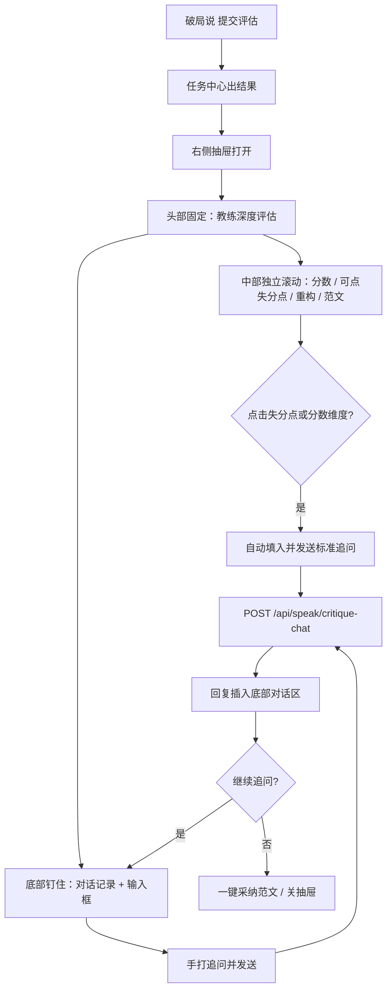

# PRD：破局(说) 破绽/失分点看全 + 可点选追问 — SP-CRIT-01

> **验收锚点：** `SP-CRIT-01`（`test_cases_7.21_7.22_feedback.md`）  
> **模块路径：** 顶栏 → 破局(说) → 完成一轮表达提交 → 右侧「教练深度评估」  
> **状态：** 草稿 · 待确认  
> **日期：** 2026-08-17  
> **原始反馈：** 7.21 说-1 —「右侧 AI 分析的破绽和失分点没办法下拉，看不到相关内容。同时我需要和 AI 的打分分析进行交互」  
> **已确认决策：** 可点选破绽追问（方案乙）· 上滚下贴布局 · 真实 AI 带本次打分上下文 · 范围仅 SP-CRIT-01

---

## 1. Executive Summary

### Problem Statement

破局(说)提交一轮后，右侧「破绽与失分点」被抽屉/父级 `overflow-hidden` 裁切，用户滚不到全文；底部虽有「漏洞靶向追问」，但输入框常被挡在折页下，且回复是前端 `setTimeout` 关键词假话术，**不读取本次分数与点评**。E2E `SP-CRIT-01` 失败。

### Proposed Solution

将右侧抽屉改为 **分析区独立滚动 + 追问栏钉底（上滚下贴）**；评估结果增加结构化 `flaws[]`（无数组则按句/换行降级切片）；点击某条失分点或分数维度 **自动发出追问**，经新接口带着本次打分快照做多轮真实 AI 回复。保留手打追问。

### Success Criteria

| # | KPI | 度量方式 | 目标值 |
|---|-----|----------|--------|
| 1 | 破绽看全 | 800 字点评在右侧分析区滚到底 | **100%** 可见、无裁切、无横向溢出 |
| 2 | 追问可达 | 抽屉打开后不滚动分析区即可看见输入框 | **100%** 钉在抽屉底部 |
| 3 | 点选追问 | 点击 `flaws[]` 任一条 | **≤1s** 发出问题；回复引用该条 `title` 或 `detail` 中 ≥4 字连续片段 |
| 4 | 手打追问 | SP-CRIT-01 问句「如何委婉指出处长逻辑漏洞？」 | **有针对性回复**（非空白、非现网三套假话术原文） |
| 5 | 验收用例 | `SP-CRIT-01` | **通过** |

---

## 2. User Experience & Functionality

### User Personas

| 角色 | 描述 | 核心诉求 |
|------|------|----------|
| **主用户·训练者** | 提交一轮表达后看教练点评并改口 | 破绽全文可见；能追问「这条为什么扣分、下一句怎么说」 |
| **次用户·高压演练者** | 分数未达 8 分被锁定、需按建议改草稿 | 不用关抽屉、不用滚完长文就能继续问 |

### User Flow



### 已锁定交互（ASCII）

```
┌─ 主工作区 70% ─────────┐  ┌─ 右侧抽屉 30% 固定高 ──┐
│ 草稿 / 提交            │  │ [头] 教练深度评估   ✕  │  ← shrink-0
│                        │  │ ┌─ 分析区 overflow-y ─┐│
│                        │  │ │ 逻辑战力 2/5  ←可点 ││
│                        │  │ │ 表达分寸 2/5  ←可点 ││
│                        │  │ │ 总分 4/10           ││
│                        │  │ │ [卡片] 空泛承诺…    ││  ← 点击即追问
│                        │  │ │ [卡片] 未给时间表…  ││
│                        │  │ │ 高维重构 / 范文     ││
│                        │  │ └─────────────────────┘│
│                        │  │ [底] 对话记录可滚      │  ← shrink-0
│                        │  │ [底] 输入框始终可见    │
└────────────────────────┘  └────────────────────────┘
```

### User Stories

#### Story 1 — 破绽与失分点可看全（SP-CRIT-01 缺陷）

**As a** 训练者, **I want** 右侧分析区能滚完破绽、重构与范文, **so that** 我看得到全部扣分理由而不是半截文字。

**Acceptance Criteria：**

- [ ] AC1.1 抽屉为纵向 flex：`header shrink-0` + `分析区 flex-1 min-h-0 overflow-y-auto` + `追问栏 shrink-0`
- [ ] AC1.2 分析区在 **1280×720** 视口下，内容超过一屏时出现纵向滚动条；滚到底可见「高维表达重构」与「满分实战话术」全文
- [ ] AC1.3 「破绽与失分点」正文与每条 `flaw` 卡片 **不被裁切**；禁止父级 `overflow-hidden` 把抽屉内容夹死
- [ ] AC1.4 分析区内滚轮/触控板滚动 **不关闭** 抽屉；点分析区空白不误关（关闭仅 ✕ 或明确的外侧点击，且点击输入框/卡片/滚动条不算外侧）
- [ ] AC1.5 `critique` 或任意 `flaw.detail` 合计 ≥800 字时，AC1.2–1.3 仍成立

#### Story 2 — 上滚下贴，随时能问

**As a** 训练者, **I want** 追问输入框钉在抽屉底部, **so that** 我不必先滚完长点评才能打字。

**Acceptance Criteria：**

- [ ] AC2.1 抽屉打开后，**不滚动分析区** 即可看见输入框与发送按钮
- [ ] AC2.2 对话记录在底部栏内独立滚动，高度上限 **160px**（约 3–4 条气泡）；超出后新消息自动滚到最新
- [ ] AC2.3 底部栏不遮挡分析区最后一张卡片的完整阅读（分析区自己滚）
- [ ] AC2.4 发送中：输入禁用、按钮 loading；失败时气泡内显示错误文案，输入框恢复可编辑
- [ ] AC2.5 删除现网 `max-h-[180px]` 把整段追问塞进分析区中部的布局

#### Story 3 — 结构化失分点可点选追问（方案乙）

**As a** 训练者, **I want** 把破绽拆成可点卡片，点哪条就问哪条, **so that** 追问对准具体扣分点而不是整段闲聊。

**Acceptance Criteria：**

- [ ] AC3.1 评估解析产出 `flaws: SpeakFlaw[]`；UI 以卡片列表展示，**至少 1 条、至多 8 条**
- [ ] AC3.2 有模型数组时用模型；无数组或非法时 **降级切分** `critique`（见 §4.3），不得空白列表
- [ ] AC3.3 点击卡片 → **自动发送**（不等用户再按发送），问题模板见 §2.5；同时写入对话记录
- [ ] AC3.4 点击「逻辑战力」「表达分寸」分数块 → 按维度模板自动发送
- [ ] AC3.5 回复必须绑定本次评估：请求带 `evalSnapshot`（分数 + 破绽全文 + 被点条目 + 范文摘要）；回复文本含被点 `title`/`detail` 中 **≥4 字连续片段**，或明确复述该维度名称
- [ ] AC3.6 卡片有 hover/焦点态；`cursor-pointer`；键盘 Enter/Space 可激活（与点击等价）

#### Story 4 — 手打多轮，吃本次打分

**As a** 训练者, **I want** 自己输入追问并多轮继续, **so that** 我能把「如何委婉指出处长逻辑漏洞」问到可出口的句子。

**Acceptance Criteria：**

- [ ] AC4.1 手打发送走同一 `POST /api/speak/critique-chat`，**禁止** 现网 `setTimeout` 三套关键词假回复作为生产路径
- [ ] AC4.2 多轮请求带最近 **最多 8 条** 对话（user/ai 交替）；新一次评估（重新提交）清空对话
- [ ] AC4.3 测试句「如何委婉指出处长逻辑漏洞？」在体制内场景下，回复须出现委婉/请教/探讨类策略，且提到用户草稿中的关键信息（如「尽快看看」「问题不大」或处长）
- [ ] AC4.4 回复纯文本，**80–400 汉字**（超长截断展示并提供「展开」）；不返回二次打分 JSON 覆盖原评估
- [ ] AC4.5 `mock=true` 路径允许固定假数据，但假回复须带被点条目标题，便于 E2E；生产路径必须打真实接口

### 2.5 自动追问模板

| 触发 | 发出的 user 文本（写入对话） |
|------|------------------------------|
| 点击失分点卡片 | `请针对这条失分点展开，并给出一句可直接说出口的改写：【{title}】{detail}` |
| 点击逻辑战力 | `请针对「逻辑战力 {logicScore}/5」说明失分原因，并给出下一次开口的 2 条改法。` |
| 点击表达分寸 | `请针对「表达分寸 {expressionScore}/5」说明失分原因，并给出更得体的 2 句替换。` |
| 手打 | 用户原文，trim 后 1–500 字；空串不发送 |

### Non-Goals

- 不覆盖 SP-SCENE-01（1VS1/多人、停止键、结束后侧写）
- 不重做说模块会话引擎，不跳转驭心沙盘
- 不把追问改成任务中心异步单（对话必须在抽屉内完成）
- 不修改左侧理论库、倒计时、双版本草稿区（除非为修滚动误关抽屉所必需）
- 不在本轮修正六维标签的硬编码展示（「地域文化适配」等）
- 不新增独立账号/权限模型；不把 Dify Key 下发浏览器

---

## 3. AI System Requirements

### Tool Requirements

#### 已有（复用，不重复造轮子）

| 组件 | 路径 |
|------|------|
| 评估入口 | `POST /api/speak/influence`（任务中心异步） |
| 评估解析 | `insightSpeakProxy.parseSpeakResult` |
| Dify 工作流 | `yml/speak_engine.yml`（`DIFY_SPEAK_INFLUENCE_KEY`） |
| 抽屉 UI | `SpeakModule.tsx` 右侧 `showContextSheet` |
| 前端评估应用 | `applySpeakEngineResult` |

#### 本轮补齐

1. **`flaws[]` 契约** — Dify 评估 JSON 增补；解析层兼容旧输出  
2. **`normalizeSpeakFlaws`** — 无数组时切句降级（前后端可共用算法，实现放服务端 + 前端一份或只服务端下发）  
3. **`POST /api/speak/critique-chat`** — 同步教练追问，不走任务中心  
4. **抽屉布局** — 上滚下贴；点选卡片自动发送  
5. **仓外 Dify** — 评估 prompt 增 `flaws`；追问用 completion/独立节点，**禁止**再跑一遍打分工作流把原评估覆盖

### 3.2 评估 JSON 契约（向后兼容）

`parseSpeakResult` 继续要求对象；`critique` / `framework_analysis` / `revised_version` / `score` 保持现网语义。新增可选：

```json
{
  "score": 40,
  "critique": "整段综述，供降级切分与全文检索",
  "flaws": [
    {
      "id": "f1",
      "title": "空泛承诺",
      "detail": "「尽快看看」「问题不大」没有时间表、责任人和风险，领导无法决策。",
      "dimension": "logic"
    },
    {
      "id": "f2",
      "title": "分寸过轻",
      "detail": "对处长用口语化打发，缺少请教姿态，容易被听成推诿。",
      "dimension": "expression"
    }
  ],
  "framework_analysis": "…",
  "revised_version": "…"
}
```

| 字段 | 规则 |
|------|------|
| `flaws` | 可选数组；缺省或非数组 → 降级切分 |
| `id` | 可选；缺省则 `f{index}` |
| `title` | 2–24 字；缺省则取 `detail` 前 24 字 |
| `detail` | 20–200 字为宜 |
| `dimension` | `logic` \| `expression` \| `other`；非法则 `other` |
| 条数 | 展示前裁剪为 1–8 条 |

**Dify 评估 prompt 增补（仓外，`speak_engine.yml` 同步）：** 在现有 JSON 上增加 `flaws` 数组，3–6 条，每条对应一个可独立改口的失分点；`critique` 仍输出综述。

### 3.3 追问模型输入

系统侧拼装（服务端，不信任浏览器随便改分数作唯一真相，但 MVP 允许客户端提交快照，服务端做长度截断）：

```
【本次评估快照】
总分: {totalScore}/10；逻辑战力: {logicScore}/5；表达分寸: {expressionScore}/5
破绽综述: {critique 截断 1200 字}
结构化失分点: {flaws JSON 截断}
范文摘要: {revised_version 截断 400 字}
用户原稿摘要: {user_input 截断 600 字}

【对话】最近 ≤8 条
【本轮用户问题】{query}
```

系统指令要点：只回答追问；给可出口的句子；不要输出新的 `score` JSON；不要否定快照中的分数除非用户明确质疑对错。

### Evaluation Strategy

| 层级 | 方法 | 通过标准 |
|------|------|----------|
| **单元** | `normalizeSpeakFlaws`：有数组用数组；无数组按 `。！？\n` 切；空 critique → 单条「暂无结构化破绽，点击可追问综述」 | 全绿 |
| **契约** | `parseSpeakResult` 旧 JSON（无 flaws）不抛错；新 JSON 保留 flaws | 向后兼容 |
| **API** | `critique-chat` mock：请求含 snapshot + query，响应 `{ reply }` | 400 缺 query；200 有 reply |
| **前端** | 抽屉：分析区可滚、输入框钉底；点击卡片发出模板句 | 组件/DOM 断言或 Playwright |
| **手工/E2E** | 附录 A：`SP-CRIT-01` | 通过 |
| **质量抽检** | 点选 5 条不同 flaws | ≥4/5 回复含该条 ≥4 字片段 |

---

## 4. Technical Specifications

### Architecture Overview

```
SpeakModule.evaluateSpeech
    │
    ▼
POST /api/speak/influence  → 任务中心 → parseSpeakResult
    │
    ▼
normalizeSpeakFlaws(parsed.flaws, parsed.critique)
    │
    ▼
右侧抽屉
  ├─ 分析区滚动：分数(可点) + flaw 卡片(可点) + 重构 + 范文
  └─ 底部钉住：interactiveChat + input
         │
         ├─ 点击卡片/分数 → 模板句
         └─ 手打
                │
                ▼
         POST /api/speak/critique-chat  { query, evalSnapshot, messages[], userId }
                │
                ├─ 截断校验
                ├─ Dify completion / 教练节点（复用 SPEAK key 或独立 Coach 应用）
                └─ { success, reply }
```

**已知根因（实现时必须处理）：**

| 现象 | 代码位置 | 处理 |
|------|----------|------|
| 滚不动 / 看不全 | 根节点 `overflow-hidden` + 抽屉 `fixed` + `transform-gpu`；内层卡片 `overflow-hidden` | 抽屉自身 `h-full flex flex-col`；分析区 `min-h-0 overflow-y-auto`；追问移出分析区 |
| 追问假回复 | `sendChatMessage` 的 `setTimeout` 关键词分支 | 生产改走 API；仅 `mock=true` 保留可断言假数据 |
| 追问折页下 | 追问写在分析区最底部 + 对话 `max-h-[180px]` | 上滚下贴 |

### API 契约

**新增：** `POST /api/speak/critique-chat`

请求：

```ts
{
  userId: string;
  query: string;                 // 1–500 字
  evalSnapshot: {
    totalScore: number;
    logicScore: number;
    expressionScore: number;
    critique: string;
    flaws: Array<{ id: string; title: string; detail: string; dimension: string }>;
    revisedVersion?: string;
    userInputExcerpt?: string;
    scenarioExcerpt?: string;
  };
  messages?: Array<{ sender: 'user' | 'ai'; text: string }>; // 最多 8 条，服务端再截
}
```

响应：

```ts
{ success: true, reply: string }           // 80–400 字为宜，硬上限 800 字截断
{ success: false, error: string }          // 4xx/5xx
```

| 项 | 规则 |
|----|------|
| 鉴权 | 与现网 `/api/speak/influence` 相同用户体系；Key 仅服务端 |
| 超时 | **25s**；超时返回明确错误，不中断抽屉 |
| 模式 | **同步 blocking**；不创建 taskQueue 任务 |
| Dify | `runDifyCompletion` 或独立 Coach workflow；**禁止**调用现有打分 `workflows/run` 并 `parseSpeakResult` |
| 限流 | 同用户 **10 次/分钟**（可与现网通用限流对齐，若无则本路由单独计数） |

**评估接口变更：** `POST /api/speak/influence` 的 `task.result` 增加可选 `flaws`；无此字段时前端/服务端降级切分。HTTP 路径与任务中心流程不变。

### 4.3 降级切分算法

```
normalizeSpeakFlaws(flaws, critique):
  1. 若 flaws 为长度 1–8 的合法对象数组 → 规范化 id/title/detail/dimension 后返回
  2. 否则对 critique trim：
     - 先按换行 / 编号（1. 2. / ①）切
     - 若仍为 1 段且长度 > 40，再按 /[。！？；]/ 切
     - 丢掉空段；每段 title = 前 24 字，detail = 全文段，dimension = other
  3. 仍为空 → 单条 { id: 'f0', title: '综合失分点', detail: critique || '暂无破绽文本，可追问本次分数含义。', dimension: 'other' }
  4. slice(0, 8)
```

### Integration Points

| 层级 | 文件 | 改动 |
|------|------|------|
| 解析 | `vocab-server/services/insightSpeakProxy.js` | `parseSpeakResult` 读取 `flaws` |
| 归一 | 新小函数（优先放 `insightSpeakProxy.js` 或 `speakFlaws.js`） | `normalizeSpeakFlaws` |
| 路由 | `vocab-server/server.js` | `POST /api/speak/critique-chat` |
| 前端 API | `src/services/difyAPI.ts` | `SpeakInfluenceResult.flaws`；`runSpeakCritiqueChat` |
| UI | `src/components/modules/SpeakModule.tsx` | 抽屉布局、卡片、真追问 |
| 测试 | `insightSpeakProxy.test.js` + 前端/路由测试 | 兼容旧 JSON、切分、聊天 400 |
| 仓外 | Dify Speak Influence prompt | 输出 `flaws`；另配追问 completion |

### 现状差距（Gap Analysis）

| 能力 | 现状 | 本 PRD 目标 |
|------|------|-------------|
| 分析区滚动 | ⚠️ 有 `overflow-y-auto` 仍被裁切 | ✅ 上滚下贴 + 修 containing block |
| 输入框可见 | ❌ 在长内容底部 | ✅ 钉底 |
| 结构化破绽 | ❌ 仅 `critique` 字符串 | ✅ `flaws[]` + 降级切分 |
| 点选追问 | ❌ 无 | ✅ 卡片/分数自动发送 |
| 真实 AI 追问 | ❌ setTimeout 假回复 | ✅ `/api/speak/critique-chat` |
| 评估任务中心 | ✅ 保持 | 维持，追问不同步任务化 |

### Security & Privacy

- Dify Key 仅服务端；追问与评估均经本站 `/api`
- `evalSnapshot` / `messages` / `query` 做长度截断，防超大 payload
- 日志可记 `userId` + query 长度，**不**把完整原稿默认打到 info 日志
- 追问结果不覆盖、不删除原评估 `evalResult`

---

## 5. Risks & Roadmap

### Phased Rollout

| 阶段 | 交付物 | 验收 |
|------|--------|------|
| **MVP（本轮）** | 上滚下贴 + `flaws[]`/降级 + 点选自动追问 + 真接口手打多轮 + 去掉生产假回复 | `SP-CRIT-01` 通过；点选抽检 ≥4/5 |
| **v1.1** | 仓外 Dify 稳定输出 3–6 条 flaws；追问流式输出 | 首 token < 3s（若 Dify 支持 stream） |
| **v2.0** | 六维标签改为真实字段；追问引用划词 | 另开 PRD |

本轮 **无「先只修滚动、追问仍假」的缩水 MVP**（已否决方案甲/仅修 UI）。

### Technical Risks

| 风险 | 影响 | 缓解 |
|------|------|------|
| Dify 评估暂不吐 `flaws` | 点选质量差 | 强制降级切分，保证 ≥1 张卡片 |
| 追问误走打分工作流 | 覆盖原分数 / 返回 JSON | 独立路由；解析到 `{score}` 则当失败 |
| 追问延迟 >25s | 用户以为卡死 | loading + 超时文案 + 可重发 |
| `transform` + `overflow-hidden` 再次裁切 | 看不全复发 | 验收以 1280×720 实机滚动为准 |
| 外侧点击关抽屉误触 | 滚轮/点卡片被关掉 | 收紧 `handleOutsideClick`；交互控件与抽屉内部点击忽略 |
| 假回复残留 | E2E 误判通过 | 生产路径无关键词三套原文；测试断言「非该原文」 |

---

## 附录 A — 验收用例 SP-CRIT-01

| 项 | 内容 |
|----|------|
| **对应需求** | 7.21 说-1：破绽/失分点可看全，可与 AI 打分分析交互 |
| **菜单路径** | 顶栏 → 破局(说) → 草稿提交评估 → 右侧「破绽与失分点」 |
| **测试数据 1** | 草稿：`处长，这个事我们尽快看看吧，应该问题不大。` |
| **步骤 1** | 提交评估，等待右侧抽屉出现 |
| **预期 1** | 不滚动底部栏即可看见追问输入框；分析区可滚，破绽卡片/综述全文可见，无裁切 |
| **步骤 2** | 滚动分析区至范文区再滚回顶部 |
| **预期 2** | 输入框始终钉底；抽屉不关闭 |
| **步骤 3** | 点击一条失分点卡片 |
| **预期 3** | 对话区出现模板问句；随后 AI 回复含该条标题或细节中 ≥4 字 |
| **步骤 4** | 手打：`如何委婉指出处长逻辑漏洞？` 发送 |
| **预期 4** | 有针对性回复（委婉策略 + 触及处长/原句），非现网三套 `setTimeout` 假话术原文 |
| **步骤 5** | 再追问一句（多轮） |
| **预期 5** | 第二次回复能衔接上一轮，不丢本次分数语境 |

---

## 附录 B — Before / After（已确认）

**Before：**

```
右侧抽屉一屏只见分数；破绽半截；
追问框要滚很久才出现，或根本滚不到；
输入后 1.2s 返回与本次点评无关的固定句子。
```

**After：**

```
分数与 2 张失分点卡片：「空泛承诺」「分寸过轻」
点「空泛承诺」→ 自动问 → AI：指出「尽快看看」无时间表，并给出口语句
底部输入框始终在；可继续问「如何委婉指出处长逻辑漏洞？」
```

---

## 附录 C — 修订记录

| 日期 | 版本 | 说明 |
|------|------|------|
| 2026-08-17 | 草稿 | 按确认项撰写：C 可点选 + 布局 2 上滚下贴 + 方案乙结构化 flaws |
