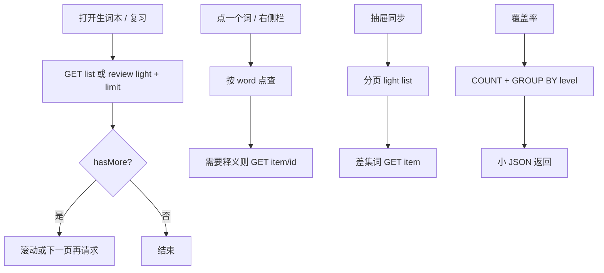

# PRD：词表/覆盖率查询去全量 — VOCAB-Q-PERF-01

> **验收锚点：** `VOCAB-Q-PERF-01`  
> **模块路径：** 生词本列表 / 今日复习 / 右侧词典面板 / 资料抽屉「从生词本同步」/ 词典覆盖率接口  
> **状态：** 草稿 · 待用户审阅确认  
> **日期：** 2026-08-19  
> **原始诉求：** 分析后台 API 查表瓶颈并给出方案；生产探针后将 P0（词表强制分页）与潜伏项（`dict-coverage` 禁止全量读 payload）写成独立 PRD  
> **已确认决策：** 范围 = 分页强制 + 覆盖率改聚合（1B）· 独立文档不挂靠其它 SLA 文案（2C）· 不改 SM-2 / 词条字段名 / 覆盖率响应 JSON 键名 · 复用已有 `{ items, hasMore }`、`/api/vocab/item/:id`、`export-background`  
> **生产探针（只读，2026-08-19）：** `/var/www/super-agent/vocab.db` 691.72MB WAL · `vocabulary` 9998 行（到期 9995）· `dict_query_log` 112830 行、payload 合计约 563MB

---

## 1. Executive Summary

### Problem Statement

生产上 `GET /api/vocab/list?light=1` 与 `GET /api/vocab/review?light=1` 在**无 `limit`** 时把约 1 万行序列化成 **3.65MB JSON**，端到端 **5.8–6.2s**。SQLite 全表 light 查询只需 **238ms**，瓶颈是无分页 HTTP 序列化与传输。前端 `getAllWords()`、抽屉 `light=0` 仍走这条路径。另：`GET /api/dify/dict-coverage` 每次把全部成功日志的 `response_payload` 读进进程再 `JSON.parse`（成功行 19691，热缓存约 231ms；冷读可到百 MB 级），会堵住同步的 Node 事件循环。

### Proposed Solution

**服务端强制分页**：`/list`、`/review` 必须带 `light=1` 且 `limit∈[1,100]`，默认 50；禁止无上限数组和 `light=0` 全 payload 列表。点查走已有 `/api/vocab/item/:id` 或按词精确匹配。覆盖率接口只做 `COUNT` + 按 `level` 列 `GROUP BY`，**请求路径禁止 `SELECT response_payload`**。前端所有「为找一个词 / 对一批词」的调用改为点查或 `IN` 批量，全量 CSV 继续走已有后台导出任务。

### Success Criteria

| # | KPI | 度量方式 | 目标值 |
|---|-----|----------|--------|
| 1 | 词表分页 GET | 生产 `GET /api/vocab/list?light=1&limit=50&offset=0`（及带 `category`）完整 HTTP | **p95 ≤ 500ms**，body **&lt; 100KB** |
| 2 | 复习分页 GET | 生产 `GET /api/vocab/review?light=1&limit=50` 完整 HTTP | **p95 ≤ 500ms**，body **&lt; 100KB** |
| 3 | 禁止全量列表 | 无 `limit` 的 `/list`、`/review`，以及 `light=0` 列表 | **HTTP 400**（或等价拒绝），不得再返回 9998 行数组 |
| 4 | 覆盖率不读 payload | `GET /api/dify/dict-coverage` 的 SQL 不含 `response_payload`；生产完整 HTTP | **p95 ≤ 500ms**；响应仍含 `total_queries` / `success_queries` / `success_rate` / `level_distribution` |
| 5 | 前端零全表拉取 | RightPanel / Dashboard 匹配词 / 抽屉同步 / `getAllWords()` 无 limit / `getDueVocabulary` | 网络面板中 **不得出现** 无 `limit` 的 `/api/vocab/list` 或 `/review`；同步后抽屉词数与点查结果一致 |

---

## 2. User Experience & Functionality

### User Personas

| 角色 | 描述 | 核心诉求 |
|------|------|----------|
| **每日训练者** | 打开生词本、今日复习、点词看词典 | 列表秒开；点一个词不要先下载整本 |
| **资料整理者** | 资料抽屉「从生词本同步」 | 能把未入库的词同步进去，不要卡死整站 |
| **抽查覆盖率者** | 调用词典覆盖率（若入口仍在） | 数字和等级分布仍能看，接口不能把服务打挂 |

### User Stories

#### Story 1 — 生词本 / 复习列表分页返回

As a 训练者, I want 打开生词本或今日复习只拉一页词, so that 首屏不超过半秒且不会拖死其它 API。

**Acceptance Criteria：**

- `GET /api/vocab/list` 与 `GET /api/vocab/review`：**必须** `light=1`（缺省视为 `light=1`）；**必须**有 `limit`，缺省 `50`，上限 `100`；响应形状为已有 `{ items, hasMore }`（`hasMore` 用 `limit+1` 探测，与现实现一致）。
- `items` 仅标量列（现有 `LIGHT_SELECT`：id/word/dict_type/category/scene_type/added_at/repetitions/ease_factor/interval_days/next_review_date/last_review_date）；`payload` 为空对象、`_light: true`，与现 `mapLightVocabRow` 一致。
- 详情仍 `GET /api/vocab/item/:id`，字段与现完整词条一致。
- `light=0` 或显式全量：`400 { error }`，文案可说明请用分页或 `/item/:id` 或 `POST /api/vocab/export-background`。
- 无 `limit` 且未走缺省 50 的旧「返回裸数组」行为废除。
- `GET /api/vocab/stats` 保持 `{ total, dueToday }`，继续用 `COUNT`，不返回列表。

#### Story 2 — 点一个词或一批词，不再拉全表

As a 训练者, I want 右侧栏和听后提取列表只查用到的词, so that 打开面板不必等 6 秒。

**Acceptance Criteria：**

- **RightPanel**：禁止 `getAllWords()`。按 `wordData.word` 做 **NOCASE 精确匹配** 点查（单条）。可用：扩展 `GET /api/vocab/list?light=1&limit=1&word=` 或等价 `GET /api/vocab/by-word?word=`；命中后再按需 `GET /api/vocab/item/:id` 补 payload。未命中则 `localWordEntry=null`，行为与现在「生词本没有这条」相同。
- **DashboardTab `loadVocabDetails`**：禁止全表 `getAllWords()`。对当前页提取出的 word/phrase/sentence 集合（通常远小于 100）一次或分页 `IN` 查询轻量行，再按需补 payload。单次 `IN` 上限 100；超出则分批，批次串行。
- **`getAllWords()`**：无 `limit` 时不得再请求 `/list?light=1` 全表。实现二选一（默认可自定）：(a) 抛错并让调用方改分页；(b) 内部只返回第一页 50 条并打日志。本 PRD 要求所有现存调用点在合并前改为 (分页 / 点查 / 导出任务)，不依赖「静默截断」作为产品行为。
- **`getDueVocabulary`**：改为 `getReviewPage`（或等价 `light=1&limit=50`），不得请求无 `limit` 的 `/review`。
- **`vocabCsvExport.exportVocabCsv`**：无传入 `words` 时不得 `getAllWords()`；引导已有 `POST /api/vocab/export-background`（任务中心）。浏览器同步导出仅允许调用方已持有的内存页数据。

#### Story 3 — 资料抽屉从生词本同步

As a 资料整理者, I want 把生词本里还没有的英语词同步进抽屉, so that 不必一次下载全部 payload。

**Acceptance Criteria：**

- 删除 `GET /api/vocab/list?light=0`。
- 同步算法：分页拉轻量列表（`limit=50~100`）直到 `hasMore=false`，与抽屉已有 `englishNotes` 按 `word` 小写去重；仅对**将要新建**的词调用 `/api/vocab/item/:id` 取 translation/example。
- 同步过程主界面可操作；失败有明确 toast；成功后 `refresh()` 与现行为一致。
- 不改变抽屉笔记的字段与「生词本同步」来源文案。

#### Story 4 — 词典覆盖率不打满事件循环

As a 抽查者, I want 覆盖率数字仍能看, so that 统计接口不会把整站 API 卡死。

**Acceptance Criteria：**

- `GET /api/dify/dict-coverage` 响应键保持：`success`, `total_queries`, `success_queries`, `success_rate`, `level_distribution`。
- `level_distribution` 键集合与现实现一致：`CET-4` / `CET-6` / `考研` / `TOEFL` / `GRE` / `BUSINESS` / `未分类`，以及现逻辑里的 `其他`（复合 `level` 字符串进 `其他`，**不改分桶规则**）。
- 该请求的 SQL **不得** `SELECT response_payload`。`total_queries` / `success_queries` 用 `COUNT(*)`。分布用 `level` 列 `GROUP BY`。
- `POST /api/dify/dict-query` 写入 `dict_query_log` 时同时写入 `level`（从已解析的 `payload.level` 或 `level` 取值，与现解析路径相同）。失败日志 `level` 可空。
- 部署包含一次**离线/启动后分块**回填，把已有 `is_success=1` 行填上 `level`；回填不得放在每次 GET 里。回填完成前，未填行计入 `未分类`（允许短暂偏差）；回填结束后分布与「按旧 JS 规则扫一遍」在抽样 100 条上一致。

### User Flow



### 已锁定交互（ASCII）

```
示例 A · 生词本第一页（达标）
T0  打开艾宾浩斯 / 词汇矩阵列表
T0+0.5s  已有最多 50 条轻量行；Network 为 /list?light=1&limit=50

示例 B · 点词（达标）
T0  打开右侧栏，词 = strategy
T0+0.5s  一次按词点查（或 item/:id），无 /list 无 limit 请求

示例 C · 旧全量（必须失败）
GET /api/vocab/list?light=1          → 400（或自动 limit=50 且响应为 {items,hasMore}，不得裸数组 9998 条）
GET /api/vocab/list?light=0          → 400
GET /api/vocab/review               → 按缺省 light=1&limit=50 的 {items,hasMore}

示例 D · 覆盖率
GET /api/dify/dict-coverage
→ JSON 小对象；服务端查询计划不含 response_payload 列扫描作结果集
```

### Non-Goals

- 不改 SM-2 复习算法、造句评估、翻转、词条 `payload` 字段名、`/api/vocab/stats` 的两个数字含义。
- 不改 `POST /api/vocab/export-background` 的任务契约与筛选 scope 语义（仍可在**任务进程**内读词表；该路径已立即回 `taskId`）。
- 不改 `stay-stats` 的 `payload LIKE`、`mastered-list` N+1、vault `linked` 全表（探针下 HTTP 均 &lt;60ms）。
- 不归档/裁剪 `dict_query_log` 历史 563MB（可列 v2，本 PRD 不做）。
- 不把浏览器改为直连 Dify；不新增 Dify 应用；不改 dict_tool `inputs`。
- 不做 UI 改版、虚拟列表视觉大改（侧栏若已分页则保持；本 PRD 只改数据拉取）。
- 不引入第二套数据库或 Redis。

---

## 3. AI System Requirements

本 PRD **不引入新的模型调用**。覆盖率与词表均为本站 SQLite 读路径。

| 能力 | 复用 | 本 PRD 用法 |
|------|------|-------------|
| 轻量列表 | `LIGHT_SELECT` + `mapLightVocabRow` + `limit/offset` | 改为强制，不再有无 limit 分支 |
| 单条详情 | `GET /api/vocab/item/:id` | 抽屉同步差集、RightPanel 补 payload |
| 词 NOCASE 索引 | 生产已有 `idx_vocab_word_nocase` | 按 word 点查必须走该索引（`EXPLAIN` 为 SEARCH 而非全表 SCAN） |
| 词典写入 | 现有 `POST /api/dify/dict-query` INSERT `dict_query_log` | 额外写 `level` 列；不改 Dify 请求体 |
| 后台导出 | `POST /api/vocab/export-background` | 浏览器禁止用 GET 全量列表代替导出 |

**Evaluation Strategy**

| 检查 | 方法 | 通过标准 |
|------|------|----------|
| 分页 SLA | 对生产或同源 `/api` 打 `list`/`review` `limit=50` 连续 20 次 | p95 ≤ 500ms；单次 body &lt; 100KB |
| 拒绝全量 | curl 无 limit / `light=0` | 非 200 全量数组；不得再出现 3MB+ 列表响应 |
| 点查计划 | `EXPLAIN QUERY PLAN` 按 word 查询 | `SEARCH ... idx_vocab_word_nocase`（或等价 word 索引） |
| 覆盖率计划 | `EXPLAIN QUERY PLAN` 对 coverage 实际 SQL | 无 `SCAN dict_query_log` 取 `response_payload` |
| 覆盖率契约 | 对比改前 JSON 键 | 键名不变；分桶规则不变 |
| 回归 | 生词本翻页、点词、抽屉同步、任务中心导出 | 功能语义与改前一致 |

---

## 4. Technical Specifications

### Architecture Overview

```
浏览器
  ├─ 列表/复习 ── GET /api/vocab/list|review ?light=1&limit≤100&offset
  │                    └─ SELECT LIGHT_SELECT ... LIMIT n+1
  ├─ 点词 ────── GET list?word= 或 by-word / 再 GET item/:id
  ├─ 抽屉同步 ── 循环分页 light list → 差集 item/:id → POST vault notes
  ├─ 导出 ────── POST /api/vocab/export-background（已有，不改）
  └─ 覆盖率 ──── GET /api/dify/dict-coverage
                     ├─ COUNT(*) dict_query_log
                     ├─ COUNT(*) WHERE is_success=1
                     └─ SELECT level, COUNT(*) ... GROUP BY level
                            （不读 response_payload）

写入
  POST /api/dify/dict-query 成功解析后
    INSERT dict_query_log (..., level)
```

**根因（生产证据，本文件不授权未确认的改代码）：**

1. HTTP 全量 light 列表 5.8–6.2s / 3.65MB；同机 SQLite 仅 238ms。
2. 到期 9995/9998，故无分页的 `/review` 几乎等于整表。
3. `dict_query_log` 体积主导 692MB 库；覆盖率按次加载成功 payload。
4. 生产已有 vocabulary / dict word 索引；**本 PRD 不以「补 word 索引」为交付**（点查须使用已有索引）。

### Integration Points

| 点 | 契约 | 变更 |
|----|------|------|
| `GET /api/vocab/list` | 分页时已是 `{ items, hasMore }` | **强制**分页；废除裸数组全量；`word` 可选精确过滤 |
| `GET /api/vocab/review` | 同上 | 同左 |
| `GET /api/vocab/item/:id` | 完整词条 | **不变** |
| `GET /api/vocab/stats` | `{ total, dueToday }` | **不变** |
| `POST /api/vocab/export-background` | `{ success, taskId, status }` | **不变** |
| `GET /api/dify/dict-coverage` | 见上 JSON 键 | **实现改、键名不改** |
| `POST /api/dify/dict-query` | 现有 ok/payload | 只加服务端列写入，响应体不变 |
| `src/services/vocabAPI.ts` `getAllWords` / `getReviewWords` / `getDueVocabulary` | 调用方 | 去掉无 limit 全表 |
| `RightPanel.tsx` / `DashboardTab.tsx` / `KnowledgeVaultDrawer.tsx` / `vocabCsvExport.ts` | 调用方 | 按 Story 2–3 改拉取 |

### 服务端规则（冻结）

```
limit = clamp(int(query.limit) or 50, 1, 100)
offset = max(0, int(query.offset) or 0)
若 query.light === '0' → 400
响应 = { items: rows[0..limit), hasMore: rows.length > limit }
禁止 SELECT * 用于这两个 GET
```

可选 `word`：`WHERE word = ? COLLATE NOCASE`，与 `idx_vocab_word_nocase` 对齐；与 `category` 同时存在时 AND。

Dashboard 批量：允许 `POST /api/vocab/lookup` `{ words: string[] }`（≤100）返回 `{ items: LightRow[] }`，或复用多次 `word=` GET。默认可自定一种，须单测。

### `dict_query_log.level`

- `ALTER TABLE ... ADD COLUMN level TEXT;`（可空）。
- 写入值 = 现 coverage 解析用的 `parsed.payload.level || parsed.level` 原始字符串，**先存原串**；GET 时用与现 JS 相同的分桶函数（精确命中表内键，否则 `其他`，空则 `未分类`）。这样复合字符串 `"CET-4 / CET-6 / ..."` 仍进 `其他`，与现状一致。
- 索引：`CREATE INDEX IF NOT EXISTS idx_dict_log_level ON dict_query_log(is_success, level);` 供 GROUP BY。

### Security & Privacy

- 继续只走本站 `/api/`；Dify Key 留服务端。
- 不新增鉴权模型（词表接口现状保持）；不把 `response_payload` 经 coverage 接口泄露到浏览器（本来就不返回原文，须保持）。
- 回填脚本只在服务器读本机 SQLite，不把日志文件打到前端。

---

## 5. Risks & Roadmap

### Phased Rollout

| 阶段 | 内容 |
|------|------|
| **MVP（本 PRD）** | 强制 list/review 分页；拒绝 light=0；前端去掉全表 GET；coverage 改 COUNT+GROUP BY；INSERT 写 level；分块回填历史 level |
| **v1.1（非本轮）** | `getAllWords` 从代码库删除；coverage 单测钉死 EXPLAIN |
| **v2.0（非本轮）** | `dict_query_log` 留存策略 / 归档（563MB），须另开需求 |

### Technical Risks

| 风险 | 影响 | 缓解 |
|------|------|------|
| 废除裸数组破坏未改到的调用方 | 前端空白 | 合并前 grep ` /list` `light=0` `getAllWords(` `getDueVocabulary`；测试用例逐条 |
| 抽屉同步改为分页后变慢（多次 round-trip） | 体验 | 每页 100；只对差集打 item；不同步阻塞 UI |
| level 回填扫 100MB+ | 部署窗口卡 API | 独立进程或 `setImmediate` 分块；GET 不参与回填 |
| Dashboard `IN` 列表过大 | SQL 过长 | 上限 100，分批 |
| 误改 coverage 分桶 | 图表数字跳变 | 抽样对比旧函数；复合 level 仍进 `其他` |

### 功能测试案例（落地后一次一项）

**VOCAB-Q-PERF-01a 列表分页（先做这一项时用）**

- **菜单路径：** 英语引擎 → 打开生词本 / 词汇矩阵列表  
- **测试数据：** 生产或同等 ≥9000 词库；请求 `GET /api/vocab/list?light=1&limit=50&offset=0`  
- **预期结果：** ≤500ms；JSON 为 `{ items, hasMore }`；`items.length≤50`；`hasMore===true`  
- **对应需求：** Story 1 KPI 1  

**VOCAB-Q-PERF-01b 拒绝全量 / light=0**

- **菜单路径：** 无（curl）  
- **测试数据：** `GET /api/vocab/list?light=0`；`GET /api/vocab/list?light=1`（无 limit）  
- **预期结果：** 不得返回万行裸数组 / 3MB+ body；无 limit 时要么 400，要么缺省 50 条的 `{ items, hasMore }`  
- **对应需求：** Story 1 KPI 3  

**VOCAB-Q-PERF-01c 右侧栏点词**

- **菜单路径：** 打开右侧词典/上下文 → 选已在生词本中的词（如 strategy）  
- **测试数据：** 该词在 `vocabulary` 中存在  
- **预期结果：** Network 无无 limit 的 `/list` 或 `/review`；词条能显示；≤500ms 量级  
- **对应需求：** Story 2  

**VOCAB-Q-PERF-01d 抽屉同步**

- **菜单路径：** 资料抽屉 → 从生词本同步  
- **测试数据：** 生词本有、抽屉英语笔记缺的至少 1 个词  
- **预期结果：** 无 `light=0`；缺词被创建；来源仍为「生词本同步」；主界面未假死  
- **对应需求：** Story 3  

**VOCAB-Q-PERF-01e 覆盖率**

- **菜单路径：** 调用 `GET /api/dify/dict-coverage`（或前端若有入口）  
- **测试数据：** 生产库有成功日志  
- **预期结果：** ≤500ms；键完整；服务端该次查询不读 `response_payload`  
- **对应需求：** Story 4 KPI 4  

---

## 审阅检查（作者自检）

- 无 TBD；KPI 为毫秒/字节/HTTP 状态，非「变快」。  
- 1B：P0 分页 + coverage 均在 Stories 内；LIKE / mastered-list / 日志归档在 Non-Goals。  
- 2C：本文独立，不引用其它 SLA 编号。  
- 未授权改代码；确认本 PRD 后另开实现，且测试案例一次一项。
