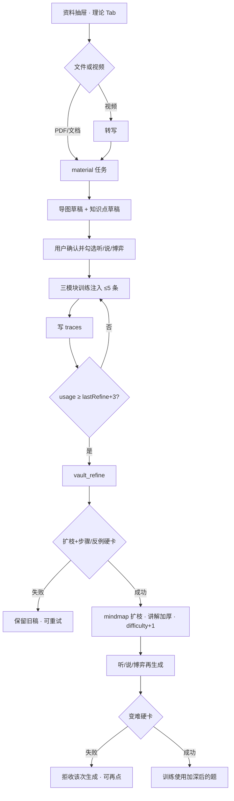

# PRD：跨模块 上传书籍/视频 → 导图+知识点并加深交互 — XF-FEED-02

> **验收锚点：** `XF-FEED-02`（建议写入 `test_cases_7.21_7.22_feedback.md`；本轮覆盖并加严 XF-FEED-01 的「再提炼」）  
> **模块路径：** 顶栏任意模块 → **资料抽屉** → 逻辑博弈框架 → 上传书籍/视频；加深后分别在 **洞察(听) / 破局(说) / 驭心博弈** 再生成训练  
> **状态：** 终稿 · 已形成（deep-interview 9 轮，ambiguity 0.09）  
> **日期：** 2026-08-17  
> **原始诉求：** 上传书籍/视频（尤其书籍）总结思维导图与知识点讲解，供系统学习并加深交互；内容随多次使用逐步精进，不长期停留简易层  
> **访谈规格：** `.omx/specs/deep-interview-xf-book-02-map-deepen.md`  
> **关联规格：** `docs/superpowers/specs/2026-08-16-xf-feed-01-vault-feed-design.md`（本 PRD **加严**：refine 必须扩枝+加厚讲解；**新增** 听/说/博弈出题变难硬卡 + 抽屉视频 Tab）  
> **已确认决策：** 不分期 · 扩枝+加厚+三出题变难缺一失败 · 抽屉视频与书同一闭环不抽手段 · 不新建学习页/Dify 应用 · 双硬卡黄金夹具 · AIM 自定阈值与启发式细节

---

## 1. Executive Summary

### Problem Statement

资料抽屉已能上传书并得到导图/知识点草稿，使用满 3 次会跑 `vault_refine`，但现网只把摘要改长一层：导图不扩枝、讲解不加厚，听/说/博弈出题引擎也不读难度。用户多次使用后仍停在首次提取的简易目录，无法当成逐步变深的系统学习材料。

### Proposed Solution

在 XF-FEED-01 闭环上升级加深任务：合格 refine 必须 **保留原枝并新增更细子枝**，且讲解含 **可执行步骤或反例**。同一触发后，洞察(听)对白/长剧本、破局(说)场景、驭心博弈案例生成必须变难并过启发式硬卡。抽屉 compact 开放视频 Tab，转写后走与书相同的导图+知识点+加深+出题变难闭环。不新建 Dify 应用，不新建独立学习页。

### Success Criteria

| # | KPI | 度量方式 | 目标值 |
|---|-----|----------|--------|
| 1 | 知识侧加深 | `evaluateVaultRefineDepth`（名称 AIM 可定） | `ok` 当且仅当新增命名子枝 **且** 至少 1 条讲解含步骤或反例 |
| 2 | 只改摘要拦截 | 黄金夹具 F-K1（三一级枝、摘要变长、结构不变） | **100%** `below_standard` / refine 不得覆盖为成功 |
| 3 | 听出题变难 | 听生成硬卡 + 夹具 F-L1/F-L2 | 浅层稿 **100%** 拒收；合格稿 **100%** 过 |
| 4 | 说出题变难 | 说场景硬卡 + 夹具 F-S1/F-S2 | 同上 |
| 5 | 博弈出题变难 | 案例推送硬卡 + 夹具 F-G1/F-G2 | 同上（可叠加 GT-CASE-02） |
| 6 | 验收故事 | `XF-FEED-02` E2E | **通过**：上传→同步→用 3 次→导图变深 **且** 三模块再生成更难 |

---

## 2. User Experience & Functionality

### User Personas

| 角色 | 描述 | 核心诉求 |
|------|------|----------|
| **主用户·系统学习者** | 上传书/录像，把知识用到听/说/博弈 | 用几次之后材料必须变深、题必须变难 |
| **次用户·视频补料者** | 只有谈判/讲座录像、没有 PDF | 抽屉内转写后走同一套导图与加深，不必去驭人术抽手段 |
| **对照用户·读模块训练者** | 穿透(读)课外书 Tab | 本项不改其上传/解码 |

### User Flow



### 已锁定交互（ASCII）

```
┌─ 资料抽屉 · 逻辑博弈框架 ─────────────────────────┐
│ [本地文档] [视频字幕]     （无「网页提取」）         │
│ 上传《谈判力》.pdf / 谈判录像.mp4 → 任务中心 material │
│ 导图 · 谈判力                                          │
│  ├ 利益          ├ BATNA              ├ 情绪           │
│  │  └（加深后）公开底线 vs 真实底线                    │
│ 知识点：BATNA  L2 已加深  使用 3                      │
│ [确认同步：听][说][博弈]                               │
└──────────────────────────────────────────────────────┘

加深后听/说/博弈再点「生成/推送」：
  不合格浅层稿 → 不进主文案（对标各模块既有拒收）
  合格变难稿 → 可练，且 knowledge 带「（加深）」
```

### User Stories

#### Story 1 — 上传书/视频得到可学的导图与讲解

As a 系统学习者, I want 在资料抽屉上传书籍或视频后看到思维导图和带讲解的知识点草稿, so that 我能确认后再用于听/说/博弈，而不是只得到一句话摘要。

**Acceptance Criteria：**

- 菜单：任意模块 → 资料抽屉 → 逻辑博弈框架。
- 测试数据：PDF《谈判力》节选（或夹具文本冒充 PDF 解析结果）；视频为短转写文本「我们先谈 BATNA…」。
- AC1.1 compact 上传器可见「本地文档」与「视频字幕」，**不可见**「网页提取」。
- AC1.2 上传后立即出现 `material` 任务；完成后理论区出现导图笔记 + 知识点草稿（最多 8 条知识点，沿用现网上限）。
- AC1.3 导图只读可展开；草稿 `syncStatus=draft`，未确认时听/说/博弈注入为空。
- AC1.4 视频成功路径 **不得** 向 `game_theory_tactics` 写入新手段。
- AC1.5 解析失败：任务失败可见原因；不得静默丢文件。

#### Story 2 — 多次使用后导图扩枝、讲解加厚

As a 系统学习者, I want 同一知识点被训练用满阈值后自动加深, so that 导图长出更细的枝、讲解出现步骤或反例，而不是摘要多了两句空话。

**Acceptance Criteria：**

- 菜单：确认同步到听（或说/博弈）→ 在该模块完成训练直至 traces 达阈 → 任务中心出现 `vault_refine`。
- 测试数据：夹具 F-K0 初始 mindmap 仅 3 个一级枝（利益/BATNA/情绪），每枝 ≤40 字解释、无步骤无反例。
- AC2.1 触发条件：同一 `noteId` traces 合计 ≥ `lastRefineUsage + 3`（默认 N=3）；`pending` 不重复入队。
- AC2.2 合格 refine 必须同时：
  - 原一级枝标题仍在；
  - 至少新增 1 个 **命名** 二级（或更深）子枝，且名称不得等于父枝或「详情/补充/其他」；
  - 至少 1 条对应知识点讲解含可执行步骤（序号或「首先/然后」类步骤）**或** 明确反例。
- AC2.3 夹具 F-K1：仅 `summary` 变长、mindmap.branches 结构不变 → **不得** 标 `refineStatus=done`，不得覆盖正文。
- AC2.4 失败：旧 mindmap/summary/content 不变；`refineStatus=failed`；卡片「重试加深」可再入队。
- AC2.5 成功：先写 revision 快照，再更新；`difficulty = min(5, difficulty+1)`。

#### Story 3 — 听/说/博弈出题必须跟着变难

As a 系统学习者, I want 知识加深之后三个训练模块再生成的题目也更深, so that 我不是拿着更深的笔记去刷同一档浅题。

**Acceptance Criteria：**

| 模块 | 菜单路径 | 生成入口（AIM 可定具体按钮，但必须是用户可点的「出题/推送」） | 变难含义（启发式由 AIM 定，夹具锁） |
|------|----------|----------------------------------------------------------------|--------------------------------------|
| 洞察(听) | 顶栏 → 洞察(听) | 动态出题 / 长剧本生成 | 对白或剧本须含隐藏底牌/信息缺口/多方张力，不得只是浅层复述书摘 |
| 破局(说) | 顶栏 → 破局(说) | 场景生成 / 定制背景 | 场景须有冲突目标与约束，不得只把加厚摘要贴进背景 |
| 驭心博弈 | 顶栏 → 驭心博弈 → 案例研判 | 案例推送 | 在 GT-CASE-02 密度之上，须用到加深后的子枝概念，不得与加深前同档简案 |

- 测试数据：同一用户已 synced、`difficulty >= 3`（或 refine 刚成功）的《谈判力》BATNA 条目。
- AC3.1 仅 `knowledge_context` 变长、生成稿与加深前同档 → 对应模块硬卡失败，**不进入** 该模块主文案（听/说/博弈沿用各模块既有拒收：不替换成功稿 / 任务失败）。
- AC3.2 合格夹具必须过该模块变难硬卡 **且** 引用加深知识中的子枝名或步骤要点（贴知识点，禁止万能套话）。
- AC3.3 三模块缺一未接硬卡 → 本 PRD **不算过**（不分期）。
- AC3.4 不改 Dify YML；用后端 prompt 注入 + 本地/服务端启发式。
- AC3.5 `difficulty < 3` 且从未成功 refine 的知识：三模块保持现网生成门槛，不强制变难项。

#### Story 4 — 系统学习发生在抽屉 + 三模块，而不是新页面

As a 系统学习者, I want 在抽屉里回看变深的导图，并在听/说/博弈里用这些知识做更难的题, so that 我不必再开一个「书籍课堂」。

**Acceptance Criteria：**

- AC4.1 不新增顶栏模块或独立路由「书籍学习」。
- AC4.2 加深后抽屉卡片可见：难度徽章、使用次数、精进状态、可展开的新子枝。
- AC4.3 注入块 `difficulty >= 3` 时标题带「（加深）」（沿用现网）。

### Non-Goals

- 不新建独立书籍学习页
- 不统一听/英语/驭人术/说模块已有上传口
- 不新建 Dify 应用、不改线上 Dify 发布
- 不改穿透(读)
- 不做拖拽导图编辑器
- 草稿未确认不自动注入
- 不改词汇本、登录画像、德州扑克
- 抽屉视频不抽驭人术手段、不写战术库
- 不把 URL 网页提取塞进抽屉 compact（本轮仍隐藏）

---

## 3. AI System Requirements

### Tool Requirements

| 能力 | 用途 | 约束 |
|------|------|------|
| 现有 `POST /api/material/process-and-extract` | 书/转写文本 → theoryNodes + mindmap | 不新开应用 |
| 现有视频转写（`VideoTranscribePanel`） | 抽屉视频 → 文本再进 material | 不新开转写服务 |
| `vault_refine` LLM | 扩枝 + 加厚讲解 | 必须输出可解析 JSON（mindmap + 知识点列表），禁止只返回一段 summary |
| 听长剧本/动态出题代理 | 变难对白 | 现有 chat/workflow 变量；后端加难度指令 |
| 说场景生成代理 | 变难场景 | 同上 |
| 博弈案例推送 | 变难案例 | `gameTheoryCasePushService` + 启发式；不改 YML |

### Evaluation Strategy

| 层 | 方法 | 通过标准 |
|----|------|----------|
| 知识 refine | 纯函数硬卡 + 黄金夹具 F-K0/F-K1/F-K2 | 见 Success Criteria 1–2 |
| 听/说/博弈生成 | 各模块启发式 + 合格/不合格夹具各 1 | 见 Success Criteria 3–5 |
| 回归 | XF-FEED-01 既有 vault extra / refine 入队测试必须仍绿 | 不得破坏草稿确认闸门 |
| 禁止 | 二次 LLM 做评委 | 与 RD-LEN-01 / GT-CASE-02 一致 |

夹具最小集（AIM 可补文件名，语义不可破）：

| ID | 输入 | 期望 |
|----|------|------|
| F-K0 | 3 一级枝浅层 | refine 前 `below` 深度卡 |
| F-K1 | 仅摘要变长 | 深度卡失败，不得 done |
| F-K2 | 原枝+「公开底线 vs 真实底线」+步骤 | 深度卡 ok |
| F-L1 / F-S1 / F-G1 | 加深知识 + 浅层生成稿 | 模块硬卡失败 |
| F-L2 / F-S2 / F-G2 | 加深知识 + 含隐藏信息/冲突/子枝名的稿 | 模块硬卡 ok |

---

## 4. Technical Specifications

### Architecture Overview

```
KnowledgeVaultDrawer
  MaterialUploader compact（file + video，无 url）
        │
        ▼
  视频? → VideoTranscribePanel → 虚拟文本文件
        │
        ▼
  POST /api/material/process-and-extract     task: material
        │
        ├─ importTheoryNodeDrafts（≤8，draft）
        └─ mindmap → extra_json.mindmap（draft）
        │
  用户 PUT sync → moduleTargets + synced
        │
  听/说/博弈 生成或点评路径 loadInjectedKnowledge
        │
  appendKnowledgeTraces
        │
  maybeEnqueueVaultRefine（N=3）            task: vault_refine
        │
        ├─ LLM JSON: { mindmap, items:[{id|title, explanation}] }
        ├─ evaluateVaultRefineDepth
        ├─ 失败: refineStatus=failed，不覆盖
        └─ 成功: revisions → 更新 mindmap+讲解 → difficulty+1
        │
  听 generateListenLongScript / 动态出题
  说 场景生成
  博弈 gameTheoryCasePushService
        │
        └─ 若 injected max(difficulty)≥3：附加变难 prompt + 模块硬卡拒收
```

### Integration Points

| 点 | 行为 |
|----|------|
| `MaterialUploader` `compact` | 显示视频 Tab；URL 仍 `!compact` 才显示 |
| `POST /api/knowledge-vault/notes/:id/refine` | 手动重试；返回 `taskId` |
| `knowledge_vault_traces` | 使用计数真相源 |
| `knowledge_vault_revisions` | refine 成功前快照 |
| 听 `server.js` 长剧本/insight 出题 | 读取 injected difficulty，注入变难指令 |
| 说 analyze/场景生成 | 同上 |
| `/api/game-theory/` 案例推送 | 叠加变难启发式，不改四维字段名 |
| Dify | 不新增变量除非仓内 YAML 已有 `knowledge_context`；未声明变量不得乱传 |

### Security & Privacy

- 视频与书籍仅属当前 `userId`；知识不跨用户。
- 转写与 LLM 走后端；浏览器不带 Dify Key。
- 导出/任务日志不写 API Key、不写内部 raw prompt 到前端。
- 文件体积沿用现网 50MB 上限；视频另遵现网转写时长/体积限制（AIM 不放宽）。

---

## 5. Risks & Roadmap

### Phased Rollout

| 阶段 | 范围 | 说明 |
|------|------|------|
| **MVP（本 PRD 全部）** | 扩枝+加厚 + 听/说/博弈出题硬卡 + 抽屉视频 Tab | **不分期**；缺一不得宣称完成 |
| v1.1 | 抽屉 URL Tab、穿透(读)接入同一闭环 | 明确非本轮 |
| v2.0 | 独立学习页、拖拽导图编辑器、自动注入草稿 | 明确非本轮 |

### Technical Risks

| 风险 | 影响 | 缓解 |
|------|------|------|
| 三套出题 prompt 同时改，回归面大 | 听/说/博弈现网质量回退 | 夹具先红后绿；`difficulty<3` 走旧门槛 |
| LLM 扩枝胡编与书无关的枝 | 学习材料漂移 | 深度卡要求子枝名贴原枝语义；失败不覆盖 |
| 视频转写空稿 | 无导图 | material 失败可见；不写空 mindmap 成功态 |
| 变难硬卡过严导致无法出题 | 用户卡死 | 失败可再点生成；主文案保留上一篇合格稿（对标 CASE-02） |
| compact 同时露出视频使抽屉变挤 | 可用性 | AIM 自定 Tab 样式，不得因此砍视频入口 |

---

## 6. 功能测试案例（验收用）

一次只验一项；通过后再测下一项。

### 案例 1 — 抽屉上传书出草稿（Story 1）

| 项 | 内容 |
|----|------|
| 对应需求 | Story 1 / AC1.1–1.3 |
| 菜单路径 | 资料抽屉 → 逻辑博弈框架 → 本地文档 → 上传夹具 PDF/文本 |
| 测试数据 | 文件名 `谈判力-节选.pdf`（或 txt 冒充解析） |
| 预期结果 | 任务中心 `material` 成功；出现导图中心「谈判力」类标题 + ≥1 条知识点草稿；未同步时听模块注入为空 |

### 案例 2 — 抽屉视频不进战术库（Story 1）

| 项 | 内容 |
|----|------|
| 对应需求 | Story 1 / AC1.4 |
| 菜单路径 | 资料抽屉 → 视频字幕 → 上传短视频或转写夹具 |
| 测试数据 | 转写含「BATNA」的短文本 |
| 预期结果 | 导图+知识点草稿出现；`game_theory_tactics` 无新增行 |

### 案例 3 — 只改摘要不得标已加深（Story 2）

| 项 | 内容 |
|----|------|
| 对应需求 | Story 2 / AC2.3 · 夹具 F-K1 |
| 菜单路径 | 单测 / 服务端 `evaluateVaultRefineDepth` |
| 测试数据 | 旧 3 枝；新 summary 200 字；branches 结构相同 |
| 预期结果 | 深度卡失败；DB 中 mindmap 与 summary 保持旧值；`refineStatus=failed` |

### 案例 4 — 合格扩枝+步骤（Story 2）

| 项 | 内容 |
|----|------|
| 对应需求 | Story 2 / AC2.2 · 夹具 F-K2 |
| 菜单路径 | 同步听 → 制造 3 条 traces → 等 `vault_refine` 或注入 F-K2 结果 |
| 测试数据 | 子枝「公开底线 vs 真实底线」+「第一步先问对方 BATNA」 |
| 预期结果 | 抽屉导图可见该子枝；卡片 L 升 1；状态「已加深」 |

### 案例 5 — 听浅层稿拒收（Story 3）

| 项 | 内容 |
|----|------|
| 对应需求 | Story 3 / AC3.1 · F-L1 |
| 菜单路径 | 洞察(听) → 在已注入 L≥3 知识后点动态出题/长剧本 |
| 测试数据 | 生成稿仅为书摘复述、无隐藏底牌 |
| 预期结果 | 硬卡失败，主文案不替换为该浅稿 |

### 案例 6 — 说/博弈同样拒收浅稿（Story 3）

| 项 | 内容 |
|----|------|
| 对应需求 | Story 3 / AC3.3 |
| 菜单路径 | 破局(说) 场景生成；驭心博弈案例推送 |
| 测试数据 | F-S1 / F-G1 |
| 预期结果 | 两模块均拒收；三模块都接硬卡后本 PRD 才可宣布完成 |

---

## 7. 与 XF-FEED-01 的关系

| XF-FEED-01 | XF-FEED-02 |
|------------|------------|
| 抽屉上传书 → 导图入库 → 同步听/说/博弈 | **保持** |
| 精进 A：difficulty 排序变难 | **保持**，不够单独算过 |
| 精进 B：摘要再写一层 | **替换为** 扩枝 + 讲解加厚 |
| compact 仅文件 | **改为** 文件 + 视频 |
| 出题引擎不变 | **必须变**（听/说/博弈） |

本 PRD 不回滚确认闸门、上限 5、traces 阈值 3、失败可重试。
