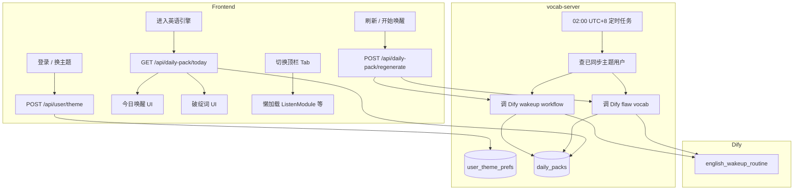

# 每日包预生成 + 顶栏解耦 — 设计文档

> 基于 deep-interview 规格：`.omx/specs/deep-interview-daily-pack-cron.md`  
> 选定方案：**方案 1 — 后端每日包 + 进站只读**

---

## 1. 架构总览



**核心原则：**
- 进站**不再**自动发起 blocking Dify；只读 SQLite 当天包。
- Dify Key 仅存在于 `vocab-server` 环境变量，前端改走后端 API。
- 英语壳可继续 keep-alive，但因无 blocking Dify，不再拖慢顶栏 lazy chunk。

---

## 2. 数据模型

### 2.1 `user_theme_prefs`（新建）

| 字段 | 类型 | 说明 |
|------|------|------|
| `user_id` | TEXT PK | 与现有 `getAppUserId()` 一致 |
| `theme` | TEXT NOT NULL | 当前学习主题 |
| `synced_at` | INTEGER | 最后同步时间戳 |
| `updated_at` | INTEGER | |

- **写入时机：** 登录成功后、`EnglishContext` 中 `theme` 变更时（debounce 300ms）。
- **Cron 筛选：** `theme IS NOT NULL AND theme != ''`。

### 2.2 `daily_packs`（新建）

| 字段 | 类型 | 说明 |
|------|------|------|
| `id` | TEXT PK | uuid |
| `user_id` | TEXT | |
| `pack_date` | TEXT | `YYYY-MM-DD`（UTC+8 日历日） |
| `theme` | TEXT | 生成时使用的主题快照 |
| `wakeup_json` | TEXT | 唤醒完整 JSON（含 vocab + grammar） |
| `flaw_vocab_json` | TEXT | 破绽词数组 JSON（6 条） |
| `source` | TEXT | `cron` \| `manual` \| `fallback` |
| `status` | TEXT | `ready` \| `failed` \| `generating` |
| `error_message` | TEXT NULL | 失败原因 |
| `created_at` | INTEGER | |
| `updated_at` | INTEGER | |

- **唯一约束：** `UNIQUE(user_id, pack_date)` — 每天每用户一份。
- **非目标：** 不保留历史日期的 UI 入口；表可保留数据供运维，前端只查当天。

### 2.3 破绽词 exclude 逻辑（服务端）

Cron / 手动重生时：
1. 读取该用户 `vocab` 表已有词（与前端 `getAllWords` 等价）。
2. 取最近 50 个作为 `history_exclude` 传给 Dify。
3. 服务端复用与前端相同的 fallback 补足逻辑（抽成共享 util 或 server 内联实现）。

---

## 3. 后端 API

| 方法 | 路径 | 说明 |
|------|------|------|
| PUT | `/api/user/theme` | `{ userId, theme }` upsert 主题偏好 |
| GET | `/api/daily-pack/today` | Query: `userId`；返回当天包；无则 `{ status: 'missing' }` |
| POST | `/api/daily-pack/regenerate` | Body: `{ userId, type?: 'wakeup' \| 'flaw' \| 'both' }`；同步生成并覆盖当天 |
| POST | `/api/daily-pack/cron-run` | 内部/运维触发（可选）；等价于 02:00 任务，便于手动补跑 |

**GET `/api/daily-pack/today` 响应示例：**

```json
{
  "success": true,
  "packDate": "2026-07-23",
  "theme": "商务谈判：让步与施压",
  "status": "ready",
  "source": "cron",
  "wakeup": { "theme": "...", "vocab": [], "grammar": {} },
  "flawVocab": []
}
```

**环境变量（server 侧新增/复用）：**
- `DIFY_WAKEUP_API_KEY` — 唤醒 workflow（不再依赖前端 `VITE_DIFY_WAKEUP_API_KEY`）
- `DIFY_API_BASE_URL` — 已有
- `DAILY_PACK_CRON_ENABLED=true` — 是否启用 02:00 任务
- `DAILY_PACK_CRON_TZ=Asia/Shanghai` — 固定 UTC+8

---

## 4. 定时任务（02:00 UTC+8）

**实现方式：** 在 `vocab-server/server.js` `app.listen` 后注册日界检查（与 Memory Dreaming 同模式），每分钟检查：

```
if (now in Asia/Shanghai is 02:00–02:01 && not yet ran today) {
  runDailyPackCronJob()
}
```

**`runDailyPackCronJob` 流程：**
1. `pack_date = today(Asia/Shanghai)`
2. `SELECT user_id, theme FROM user_theme_prefs WHERE theme != ''`
3. 对每个用户串行（避免 Dify 并发打满）：
   - 若已有 `daily_packs` 且 `status=ready` 且 `source=cron` → skip
   - 标记 `generating` → 调 wakeup + flaw → 写 `ready` 或 `failed`
4. 日志：`[DailyPack Cron] user=X ok|fail reason=...`

**失败策略（非目标确认）：** 不建可视化重试队列；失败记 `status=failed` + 日志；用户可手动「重新生成」。

**未同步主题用户：** 跳过；首次登录同步主题后，**次日** 02:00 纳入（符合 interview 决策 C）。

**当日首次登录且尚无当天包：** GET 返回 `missing` → 前端展示「今日内容准备中」+ 提供「立即生成」按钮（走 regenerate，不阻塞顶栏）。

---

## 5. Bug 修复：顶栏空白解耦

### 根因（已确认）
进站时 `DailyErrorVocabularyModule` mount 即 blocking Dify；英语壳 keep-alive 使请求持续；用户切顶栏时 lazy chunk 与网络争用 → 长时间 `ModuleSkeleton`。

### 改动

| 文件 | 改动 |
|------|------|
| `DailyErrorVocabularyModule.tsx` | 删除 mount 时 `generateDailyFlawVocabulary`；改为 `GET /api/daily-pack/today` 读 `flawVocab`；「刷新词汇」→ `POST regenerate type=flaw` |
| `DailyWakeupModule.tsx` | 进站读当天 `wakeup` 预填 `result`（若有）；「开始今日唤醒」在无缓存时调 regenerate，有缓存时直接展示并开计时 |
| `difyAPI.ts` | `runEnglishWakeupRoutine` / `generateDailyFlawVocabulary` 标记 deprecated 或改为调后端 API 薄封装 |
| `EnglishContext.tsx` | `theme` 变更 + 初始 mount 时 `PUT /api/user/theme` |
| `MainContent.tsx` | **可选增强：** 顶栏 Tab hover 时 `import()` 预取 chunk（降低首次 skeleton 时长）；非必须 |

**验收：**
- 进站 3 秒内切「洞察(听)」，骨架应在数秒内结束（不因 Dify pending 分钟级卡住）。
- Network 面板：切顶栏时不应出现新的 `/dify/workflows/run`（来自破绽/唤醒）。

---

## 6. 前端交互（保留重新生成）

### 今日唤醒
- 有当天 `wakeup`：`result` 预填，按钮文案「重新开始今日唤醒」→ regenerate 覆盖。
- 无缓存：显示主题 +「开始今日唤醒」→ regenerate；loading 仅作用于唤醒卡片区域。

### 每日破绽推送
- 有缓存：直接展示 6 词；副标题改为「今日预生成 · 可刷新」。
- 「刷新词汇」→ regenerate `flaw`；保留收录生词本逻辑不变。

---

## 7. 错误处理

| 场景 | 行为 |
|------|------|
| 当天 cron 失败 | GET 返回 `status=failed`；UI 提示 + 手动生成 |
| regenerate 超时 | 卡片内错误提示；顶栏不受影响 |
| Dify Key 未配置 | server 日志告警；flaw 走 fallback 词库；wakeup 返回明确错误 |
| 用户无 theme 同步 | cron 跳过；前端提示先选主题 |

---

## 8. 测试计划

| # | 路径 | 数据 | 预期 |
|---|------|------|------|
| T1 | 英语引擎 → 立刻切洞察(听) | 有当天缓存 | 顶栏 <10s 出内容，无长时 skeleton |
| T2 | 同上 | 无缓存 | 顶栏可切换；英语区显示「准备中」 |
| T3 | 换主题 | 新 theme | `PUT /api/user/theme` 成功 |
| T4 | 手动刷新破绽词 | 有词 | 覆盖当天 flawVocab |
| T5 | 模拟 cron | 已同步用户 | `daily_packs` 写入 ready |
| T6 | 未同步用户 | 无 prefs | cron skip |

---

## 9. 实现顺序建议

1. DB 表 + `/api/user/theme` + `/api/daily-pack/*` + server Dify 调用
2. Cron job + 日志
3. 前端改读 API + 主题同步
4. 移除进站自动 Dify
5. 联调 + 测试 T1–T6

---

## 10. 不在本版范围

- 多时区、历史日历、失败队列 UI
- 顶栏 Listen/Speak/Read 业务逻辑改动
- 前端 env 中移除 `VITE_DIFY_WAKEUP_API_KEY`（可后续清理，本版先停用调用路径）
